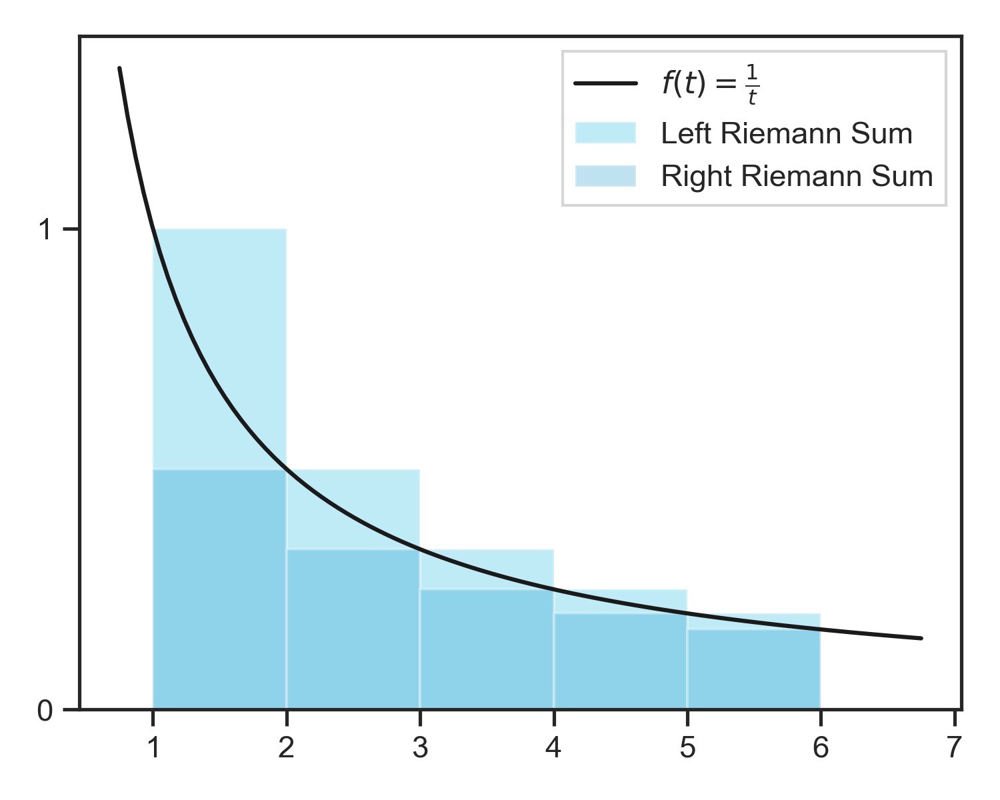
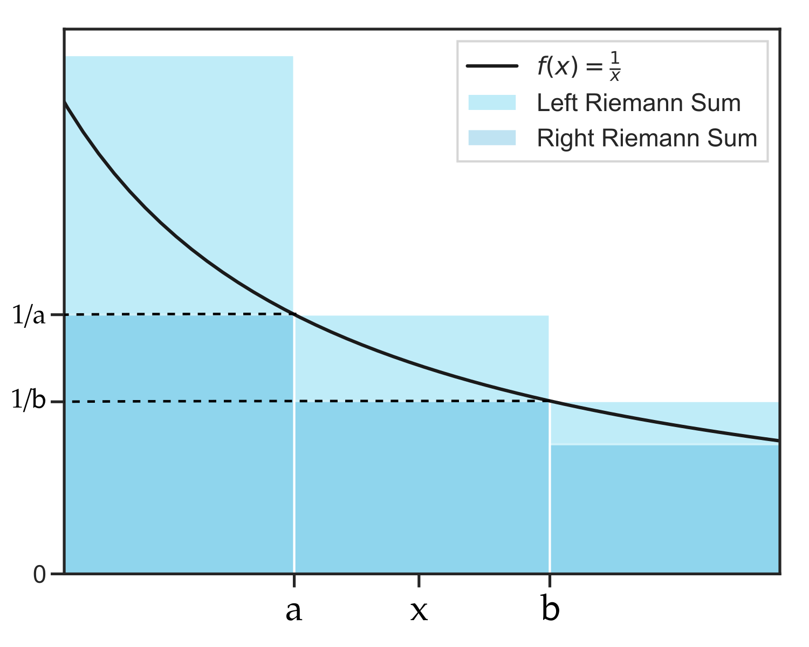

#### Fourth Proof for the infinitude of primes using calculus  

##### Proof by contradiction  

Assume that the number of primes is bounded.  

The number of primes less than or equal to a real number $z$ is given by  
$$
\pi(x) :=\#\{p\le z:p\in\mathbb{P} \}, \text{ where }\mathbb{P}\text{ is the set of primes }p_1,p_2,p_3\ldots
$$

##### Steps:  

1. The natural logarithm is monotonically decreasing  
2. Left Riemann sum approximation of the natural logarithm corresponds to the harmonic numbers   
3. Fundamental theorem of arithmetic  
4. Tricks of bounds  

---

##### 1. The natural logarithm is monotonically decreasing  

The natural logarithm is defined as:  
$$
\ln{x}=\int_{1}^{x}\frac{1}{t}dt = \int_{1}^{x}f(t)dt, \text{ where } f(t)=\frac{1}{t}dt
$$
The first and second derivatives of $f(t)$ are:  
$$
f'(t) = -\frac{1}{t^2}\qquad\text{and}\qquad f''(t) = \frac{2}{t^3} \\
\forall{t>1},\ \ f'(t) < 0\ \text{ and }\ f''(t) > 0
$$    
Thus, $f(t)$ has a negative slope and is convex everywhere for $t>1$ and is monotonically decreasing.  

---

##### 2. Left Riemann sum approximation of the natural logarithm  

Consider the points $a,\ b,\ x$ as values of $t$ for the function $f(t)$ such that $a \le x \le b$:  

Since $f(t)$ is monotonically decreasing,  
$$
f(a)\ge f(x) \ge f(b) \\
\int_a^b f(a) \ge \int_a^b f(x) \ge \int_a^b f(b) \\
\text{the integral corresponds to the area enclosed in the rectangles} \\
\frac{b-a}{a} \ge \int_a^b f(x) \ge \frac{b-a}{b} \\
\text{Left Riemann Sum} \ge \int_a^b f(x) \ge \text{Right Riemann Sum}
$$
The above can be generalized to the integral and its approximation for $f(t)$ from $1$ to $x$ as:  
$$
\text{Left Riemann Sum} \ge \int_1^x f(t) \ge \text{Right Riemann Sum}
$$
Focusing on the Left Riemann Sum and according to the definition of the logarithm:  
$$
\ln{x}\le \text{Left Riemann Sum approximation}
$$
Consider the upper bound on prime numbers $z$, such that $n\le z < n+1$ for some $n$:  
$$
\ln{z} \le 1+\frac{1}{2}+\frac{1}{3}+\ldots+\frac{1}{n-1} +\frac{1}{n}\\\text{(width of each rectangle in Riemann sum = 1)}
$$
Since all the numbers $1,2,\ldots,n$ are $\le z$ (since $n\le z$ ), they have only prime divisors $\le z$. If we consider all possible numbers that can be formed using only primes less than $z$, then the sum of these will be larger than the sum above.  
$$
1+\frac{1}{2}+\frac{1}{3}+\ldots+\frac{1}{n-1} +\frac{1}{n} \le \sum\frac{1}{m}
$$
where $m\in\N$ such that they only have prime divisors $p\le z$. Thus  
$$
\ln{z} \le \sum\frac{1}{m}
$$

##### 3. Fundamental theorem of arithmetic  

By the fundamental theorem of arithmetic, each $m$ can be written in a unique way as a product of primes:  
$$
m=\prod_{p\le z}p^{k_p}
$$
Therefore,  
$$
\ln{z} \le \sum\frac{1}{m} = \sum\frac{1}{\prod_{p\le z}p^{k_p}}
$$
Taking the above equation with only 2 primes $p_1, p_2$ and expanding, we get  
$$
\sum\frac{1}{m}=1+\frac{1}{p_1}+\frac{1}{p^2_1}+\frac{1}{p^3_1}+\ldots \\
\qquad \qquad \frac{1}{p_1p_2}+\frac{1}{p^2_1p_2}+\frac{1}{p^3_1p_2}+\ldots \\
\qquad \qquad \frac{1}{p_1p^2_2}+\frac{1}{p^2_1p^2_2}+\frac{1}{p^3_1p^2_2}+\ldots \\
\sum\frac{1}{m}=(1+\frac{1}{p_1}+\frac{1}{p^2_1}+\frac{1}{p^3_1}+\ldots)(1+\frac{1}{p_2}+\frac{1}{p^2_2}+\frac{1}{p^3_2}+\ldots) \\
$$
Thus, for all primes $p\le z$ the sum can be written as  
$$
\ln{z} \le \sum\frac{1}{m} = \prod_{p\le z}({\sum_{k\ge 0}\frac{1}{p^{k}}}) \\
\text{where the inner sum }{\sum_{k\ge 0}\frac{1}{p^{k}}} \text{ is a geometric series with ratio }\frac{1}{p} \\
\ln{z} \le \prod_{p\le z}\frac{1}{1-\frac{1}{p}} \\
\ln{z} \le \prod_{p\le z}\frac{p}{p-1} \\
$$

##### 4. Tricks of bounds  

The bound on the product above $p \le z$ can be expressed in terms of primes indexed by $k$ where $k$ extends from the first prime ($k=1$) to the last prime, bounded by $\pi(z)$  
$$
\ln{z} \le \prod_{k=1}^{\pi(z)}\frac{p}{p-1} \\
$$
Examining the trends of primes and their respective indexes, at index $k=1,\ p_1=2$, at $k=2,\ p_2=3$, at $k=3,\ p_3=5$ and so on, leading to the observation that the primes grow faster than their index (enumeration), formally stated as:  
$$
p_k\ge k+1 \\
\text{Rearranging terms:}\\
p_k-1\ge k \\
\frac{1}{p_k-1}\le \frac{1}{k} \\
1+\frac{1}{p_k-1}\le 1+\frac{1}{k} \\
\frac{p}{p_k-1}\le \frac{k+1}{k} \\
$$
Substituting this inequality in the product above:  
$$
\begin{equation}
\ln{z} \le \prod_{k=1}^{\pi(z)}\frac{k+1}{k} \\
\text{But, }\prod_{k=1}^{\pi(z)}\frac{k+1}{k} = \frac{2}{1}+\frac{3}{2}+\frac{4}{3}+\ldots+\frac{\pi(z)-1}{\pi(z)-2}+\frac{\pi(z)}{\pi(z)-1}+\frac{\pi(z)+1}{\pi(z)}\\
\text{Alternate numerators and denominators cancel out, leaving:}\\
\prod_{k=1}^{\pi(z)}\frac{k+1}{k}=\pi(z)+1
\end{equation}
$$
Thus,  
$$
\ln{z}\le \pi(z)+1
$$
Since the natural logarithm is unbounded ($\ln{z}\rightarrow\infty$ as $z\rightarrow\infty$), we have a contradiction and $\pi(z)$ can not be bounded. Thus, $\pi(z)$ is unbounded and there are infinitely many primes.  