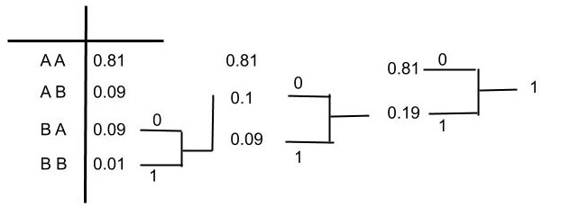

#### Effiiciency

Efficiency of  a code ($C$) is defined as

$$
 \begin{equation}
    \eta = \frac{H(X)}{L(C)}
\end{equation}
$$
where $H(X)$ is the entropy of the message symbols and $L(C)$ is the average code word length. Also, $0 \leq H(X) \leq L(C)$, this implies $0 \leq \eta \leq 1$.

* Find $H(X)$, $L(C)$ and $\eta$ for the example in Table I (Use Huffman code to find the code word of alphabet):

Table I: Compute the efficiency.

| Alphabet | Probability |
| -------- | ----------- |
| A        | 0.9         |
| B        | 0.1         |

$$
L(C) = 1 \times 0.9 + 1 \times 0.1  = 1 bit\\
H(X) = - 0.9 \log_{2}(0.9) - 0.1 \log_{2}(0.1) = 0.46  bits\\
\eta = \frac{H(X)}{L(C)} = 0.46 = 46 \%\\
$$

Now, how to improve the efficiency of code by still using the huffman code.

This can be done by creating a different alphabet. The different alphabet is obtained by taking two at a time (i.e AA, AB, BA, BB). Here we assume independence, so the probability of A and A is $P(A)\times P(A) = 0.81$. Similarly for AB, BA and BB. Table II shows the new alphabet and its corresponding probabilities.

Table II: Compute the efficiency.

| Alphabet | Probability |
| -------- | ----------- |
| AA       | 0.81        |
| AB       | 0.09        |
| BA       | 0.09        |
| BB       | 0.01        |

Figure 1: Computing Huffman code for the example in Table II.

Table III : Huffman Code for the example in Table II.

| Alphabet | Probability | Codeword |
| -------- | ----------- |----------|
| AA       | 0.81        |0         |
| AB       | 0.09        |11        |
| BA       | 0.09        |100       |
| BB       | 0.01        |101       |

In this case, the average code word length $L_{new}(C) = 1 \times 0.81 + 2 \times 0.09 + 3 \times 0.09 + 3 \times 0.01 = 1.29$ bits/pair.

$L_{new}(C)$ per symbol $= \frac{1.29}{2} = 0.645$ bits/symbol.

Since we assumed independence of A and A, A and B, B and A, B and B, therefore $H_{new}(X) = 2 \times H(X)$ bits/pair.

$H_{new}(X)$ per symbol $= H(X)  = 0.46$ bits/symbol

Therefore, $\eta_{new} = \frac{H_{new}}{L_{new}(C)} = \frac{ H(X)}{L_{new}(C)} = \frac{ 0.46}{ 0.645} = 0.71$ bits/symbol.

The above concept is called blocking. Here we used a block size = 2. Blocking increases the efficiency. The disadvantage of blocking is the storage of more symbols. For example if there are 26 input alphabet and if we use a blocksize $=2$, then we need to store $26^{2}$ new alphabets. Blocking always increases the efficiency but the storage of new alphabets is the constraint. Blocking is true for Shannon-Fano coding as well.

### Source Coding Theorem

What is the best possible $L(C)$?

For a discrete memoryless source it is possible to construct a prefix free code $C$, whose average codeword length $L(C)$ is $H(X) \leq L(C) < H(X) + 1$.

##### Proof

$H(X) \leq L(C)$

Consider $H(X) - L(C) = - \sum_{i =1}^{L} p_{i} \log_{2}(p_i) - \sum_{i =1}^{L} p_{i} n_{i}$
where $n_1, n_2, \ldots, n_L$ are codeword length of a prefix free code $C$.    

$$\begin{align*}H(X) - L(C) &= \sum_{i = 1}^{L} p_{i} \log_{2}(\frac{1}{p_i}) + \sum_{i =1}^{L} p_i \log_{2}2^{-n_i}   \\

H(X) - L(C) &= \sum_{i = 1}^{L} p_i \log_2 \bigg(\frac{2^{-n_i}}{p_i}\bigg)\end{align*}$$    

Using the inequality,

$$\sum_{i = 1}^{L} p_i \log_2 (\frac{2^{-n_i}}{p_i}) = \frac{1}{\ln(2)}\sum_{i=1}^{L}\ln(\frac{2^{-n_i}}{p_i} )\leq \frac{1}{\ln(2)} \sum_{i=1}^{L} p_i (\frac{2^{-n_i}}{p_i} - 1)$$  

On further simplification we have,    

$$\sum_{i = 1}^{L} p_i \log_2 (\frac{2^{-n_i}}{p_i}) = \frac{1}{\ln(2)}\sum_{i=1}^{L}\ln(\frac{2^{-n_i}}{p_i}) \leq \frac{1}{\ln(2)}(\sum_{i=1}^{L} 2^{-n_i} - \sum_{i=1}^{L} p_i )$$   

$$\sum_{i = 1}^{L} p_i \log_2 (\frac{2^{-n_i}}{p_i}) = \frac{1}{\ln(2)}\sum_{i=1}^{L}\ln(\frac{2^{-n_i}}{p_i}) \leq \frac{1}{\ln(2)} \sum_{i=1}^{L} 2^{-n_i} - 1$$    

By Krafts Inequality,   

$$\sum_{i=1}^{L} 2^{-n_i} \leq 1$$    

As a result,   

$$H(X) - L(C) \leq 0$$

##### Second part of Proof

$$L(C) < H(X) + 1$$

Choose a codeword such that $2^{-n_i} \leq p_i < 2^{-n_i + 1}$, $\forall i = 1, \ldots, L$ and $p_i \neq 0$.

$n_1, \ldots n_L$ are the codeword lengths.

Choosing $n_i$ such that for every $p_i$ the following is true:    

$$\begin{align*}\underbrace{\sum_{i=1}^{L}2^{-n_i} \leq \sum_{i=1}^{L}p_i} &< \sum_{i=1}^{L}2^{-n_i + 1} \\
\sum_{i=1}^{L}2^{-n_i} \leq 1 \end{align*}$$

satisfies the Kraft's Inequality. This implies there are codewords which are prefix free.

From the assumption we have,  

$$2^{-n_i} \leq  \underbrace{p_i < 2^{-n_i + 1}}$$  

Take $\log$ on second part of inequality.   

$$\begin{align*}\log_{2} p_i &< \log_{2} 2^{-n_i + 1} \\

\log_{2} p_i &< -n_i + 1 \\

n_i &< -\log_{2}p_i + 1\end{align*}$$   

Multiply by $p_i$ on LHS and RHS,  

$$\begin{align*} p_{i}n_{i} &< -p_{i}\log_{2}p_{i} + p_{i} \\

\sum_{i = 1}^{L}p_{i}n_{i} &< - \sum_{i=1}^{L}p_{i}\log_{2}p_i + \sum_{i = 1}^{L}p_i\\

\implies L(C) &< H(X)+1 \end{align*}$$  

The above suggests that good code word exists.
