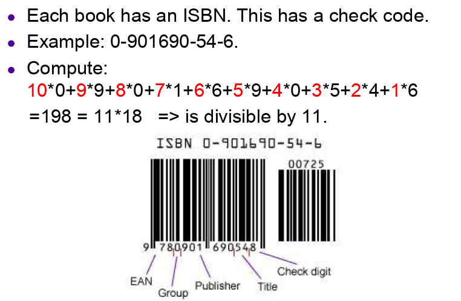

### Recap:

**Random Experiment:** Always given by the **Sample Space** $\mathbb S$, which is a set of all possible outcomes. Hence, if the set $\mathbb S$ is discrete, then it is known as a *Discrete Random Experiment*, and the outcome of such an experiment is also discrete.  

Let $\mathbb S = \{O_1, O_2, \ldots, O_n\}$ with probabilities $P = \{p_1, p_2, \ldots, p_n\}$. Then a *Discrete Random Variable* $X$ maps $O_i$ to the real line.  

In this setup, the *Entropy* can be defined as  
$$ H(X) = \sum_{i=1}^n p_i \log_2 \frac{1}{p_i} \text{ bits}$$  

The problem in **Source Coding** is that set of messages is transmitted. Each message can be a sequence of elements of $\mathbb S$. In this case, each element of $\mathbb S$ is known as a **symbol**.

**Symbol Codes**: A map of codewords to the alphabet.

Let $L(c)$ be the average codeword length of the Code $c$, then, we can always design a prefix free code if and only if the following is true:  
$$ H(X) \leq L(c) < H(X) + 1 $$  
where, $H(X)$ is the symbol code entropy. Here, both are measured in `bits/symbol`.

**Efficiency of a Code:**  
$$ \eta = \frac{H(X)}{L(c)}  $$  

**Code Blocking:** increases the efficiency of the code, but on the flip side, also increases the complexity of the code. But having more than one alphabet per symbol helps in building a **context**, which can also be looked at as a *mathematical model* which is more efficient.

Inferentially, all systems(physical, biological etc.) follow this kind of logic, except, some of them might use continuous random variables instead of discrete. But in any experiment, when a measurement is done, it is discrete in nature since the measuring instruments are typically discrete in nature. It is easier to store discrete measurements, also, their digital processing is more accurate. Hence, it is decide to discuss which Codes are 'good'.

------

## Stream Codes:

All symbol codes need at least 1`bit/symbol` irrespective of the probabilities. For example, in case of a *Binary Alphabet* without blocking, we need the length of 1`bit/symbol`. But blocking will increase the average length.

The idea of **Stream Coding** is that the whole message is counted as a block, without creating any other block that is combinatorially possible. This is a key construct, since the problem with other Coding techniques like *Huffman Coding* is that blocking will exponentially increase the number of symbols. For example, if we have 26 alphabets, then:  

Block Size | No. of symbols
---------- | --------------  
1|$26$  
2|$26^2$
3|$26^3$  


Hence, Stream Codes focus only on the particular sequence we are interested in. The central objective is finding a codeword for that particular sequence/stream of symbols, without worrying about other possible sequences.

### Arithmetic Coding

In _Arithmetic Coding_, real numbers are used as codewords. The technique of using real numbers as codewords started gaining popularity in 1960's, but a Shannon-Optimal Code was formulated only  in 1979 in the form of _Arithmatic  Coding_.


Arithmetic Coding is considered far superior to _Huffman Coding_, because the same efficiency can be achieved with much lower complexity. It is commonly used in `MPEG-4` encoding.

For example, consider a message `AABABBABAA`, where the *fixed* encoding length of a message is 10. This fixed encoding length is a part of the _overhead information_, i.e., a priori, the decoder knows that the length of the message is 10. Hence, in each message, we can find $p(A)$ and $p(B)$, which in this case is:

Alphabet | Probability  
-------- | -----------  
`A`|$p(A) = \frac{6}{10} = 0.6$  
`B`|$p(B) = \frac{4}{10} = 0.4$

The innovative step in this algorithm is that each alphabet is first associated to a real interval, which in this case:

Alphabet | Interval the codeword lies in
-------- | -----------------------------  
`A`|$[0, 0.6]$  
`B`|$(0.6, 1]$


We know, that the final code of the message will be a real number. Here, we see that the message starts with `A`, which implies that the required codeword is clearly in the interval $[0, 0.6]$.

Now, we break this interval into the same ratio as the probabilities, i.e. now,

Alphabet | Interval the codeword lies in
-------- | -----------  
`A`|$[0, 0.36]$  
`B`|$(0.36, 0.6]$

The second alphabet in the message is again `A`. Implication is, the required codeword lies in the interval $[0, 0.36]$.

Again, we break this interval into the same ratio as the probabilities.

Alphabet | Interval the codeword lies in
-------- | -----------  
`A`|$[0, 0.216]$  
`B`|$(0.216, 0.36]$

Now the third alphabet in the message is `B`. Hence, our codeword lies in the interval $[0.216, 0.36]$.

Similarly, the interval becomes finer as the length of the message increases. in this case, the final interval we obtain is: [0.29355264, 0.2947470336)

> Note: Open('[.)', '(.]') and close('[.]') intervals are being used here just for the sake of mathematical consistency, it does not matter for computational purposes

The midpoint of the final interval is calculated and converted into binary format for obtaining the final codeword.

Hence, Arithmetic Coding can be understood by the following algorithm:  
**Encoding:**
```
p[A] = 0
p[B] = 0
M = 'AABABBABAA'
I = [0, 1]

function FindCodeword(message)
  p[A] = No. of occurrences of 'A' in message/length of message
  p[B] = No. of occurrences of 'B' in message/length of message
  I = SetInterval(message, I, 0)
  return binary((I.UpperBound - I.LowerBound)/2)

function SetInterval(message, interval, iteration)
  if iteration + 1 > length of message
  then return interval
  else
    iteration = iteration + 1
    lb = interval.LowerBound
    ub = interval.UpperBound
    if message[iteration] = 'A'
    then interval = [lb, (ub - lb)*p[A]]
    else interval = [(ub -lb)*p[B], ub]
    SetInterval(message, interval, iteration)    

C = FindCodeword(M)
```
A possible issue with this algorithm is that the final interval we reach might suffer truncation error in a computer. That is why a fixed block size is used.

>Arithmetic Coding is a consequence of chaos. This will be shown in a further lecture.

Now, the decoder knows that the final number is between 0 and 1. If `M` in the above algorithm was `null`, then the decoder is expected to receive 0.5.


In general, lets say that we have a number $N \in[0, 1]$, the number of bits required to store it in binary is $\lfloor - \log_2 N \rfloor + 1$.

To represent any interval $[A, B] \in [0, 1]$ in binary, we need $\lfloor -\log_2 (B-A) \rfloor + 1$ bits, since, the total number of intervals of size $(B-A)$ is:  
$$ n(B-A) = 1 $$  
$$\implies n = \frac{1}{(B-A)}$$  

#### Theorem: Arithmetic Coding is Optimal

#### Proof:

Length of the final interval($l$)  = $p^k(1-p)^{N-k}$   
>where, $p(A) = p$  
$p(B) = 1-p$  
$N$: length of the input message  
$k$: number of `A`'s   


Number of bits needed to encode $l$:  
$$ N_{bits} = -\log_2(p^k(1-p)^{N-k})$$   
$$ = -\log_2 p^k - \log_2 (1-p)^{N-k}$$  
$$ = -k\log_2 p - (N-k)\log_2 (1-p) $$  

Hence, number of bits per symbol = $N_{bits}/N = -\frac{k}{N}\log_2 p - \frac{N-k}{N}\log_2 (1-p)$

Assuming that the message source is a stationary i.i.d source, as $N \to \infty$, $\frac{k}{N} \to p$ and $\frac{N-k}{N} \to (1-p)$. Then,  
$$ \frac{N_{bits}}{N} = -\frac{k}{N}\log_2 p - \frac{(N-k)}{N}\log_2 (1-p) $$  
$$ = -p\log_2 p - (1-p)\log_2 (1-p)$$  
$$ = H(X) $$  

**Decoding:**  

At the decoder, the length of the message `M` and probabilities $p(A)$ and $p(B)$ are known. From the encoder, we receive the midpoint of the final interval. Just like the encoder, interval $[0, 1]$ is divided into intervals $I_A = [0, p_A)$, $I_B = (p_B, 1]$. Then the midpoint of the final interval is traced in one of these two intervals.  

Once the required interval is selected, the symbol (`A` or `B`) corresponding to that interval is recorded. In the current example, $I_A$ will be chosen.

Now, again, just like the encoder, $I_A$ will be broken into two parts, namely $I_{AA} = [0, p_A^2)$, and $I_{AB} = (p_Ap_B, p_A]$, and the midpoint is traced in one of these intervals. Once the required interval is traced, the next symbol is recorded.

In this manner, the whole message is decoded. But this heuristic method has a tendency to continue forever. That's where the fixed length of message comes in handy. As a result, we end up adding an extra bit of information.  

---
## A Motivation to Channel Coding:

**Channel Coding and Error Control Coding**   is considered as the third pillar of Information Theory, akin to **Source Coding or Data Compression** and **Encryption or Cryptography**. It owes its importance to the noise that an interfere in the transmission channel of Information flow.

**Error:** An error occurs when the transmitted bit is not the same as the received bit. The aim of Channel Coding is to detect and correct these errors.

Hence, **Channel Coding** is essentially a pre-processing of the data before transmission. Redundancy is added to Information. The output is longer than the input.  

#### Repetition Codes:
Let's say we want to transmit the message `010110`. Then, in a $\mathbb R_3$ repetition code, every bit is repeated thrice, making the new message to be transmitted `000 111 000 111 111 000`. Now let's say we receive `000 101 100 111 001 000`. So, on the decoder  side, we count the majority bit in every group of 3 bits. So, after decoding, the received message becomes `010100`, which is very close to the actual message `010110`, even after 4 errors occurred in transmission. Typically, consecutive errors do not occur in most of the channels.

#### Error Detection and Correction:

##### Why Error Detection?
Error detection is less computationally intensive, and once you know that the error has occurred, transmission can be repeated and the average of the two received Codes can reduce the error.

#### Parity bit:
Consider a block of `0`'s  and `1`'s, and append this block with a `0` if there are odd number of `1`'s in the message.

>Channel Coding techniques can only detect **accidental** errors, such as corruption of stored data or transmission. They cannot handle attacks by a malicious agent.

##### Examples:

  

In the above figure, `310413044` is appended with `310413044 mod 7 = 2`. So, if the ticket is counterfeit, there will be an algorithm that checks this. So, if there is a typing mistake or some other accidental error in the ticket number, it'll get detected instantly.

Another example are *International Standard Book Numbers(ISBN)*

   
As we  can see, divisibility by 11 is checked here.

Hence, the intuition behind  Channel Coding is modelling the channel and predict the likeliness of occurrence such accidental errors.
