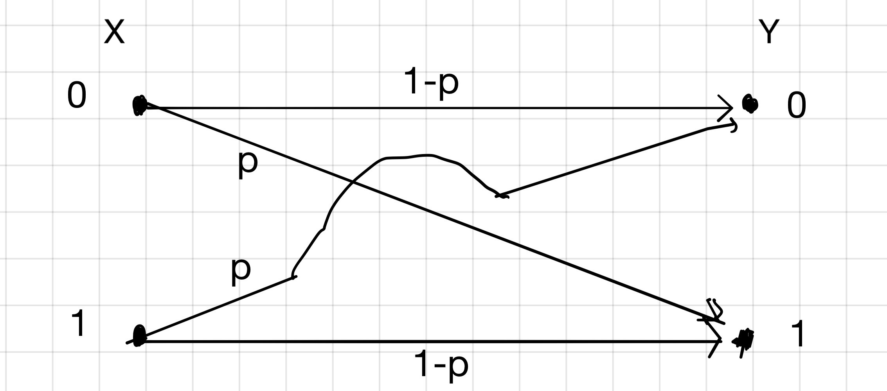
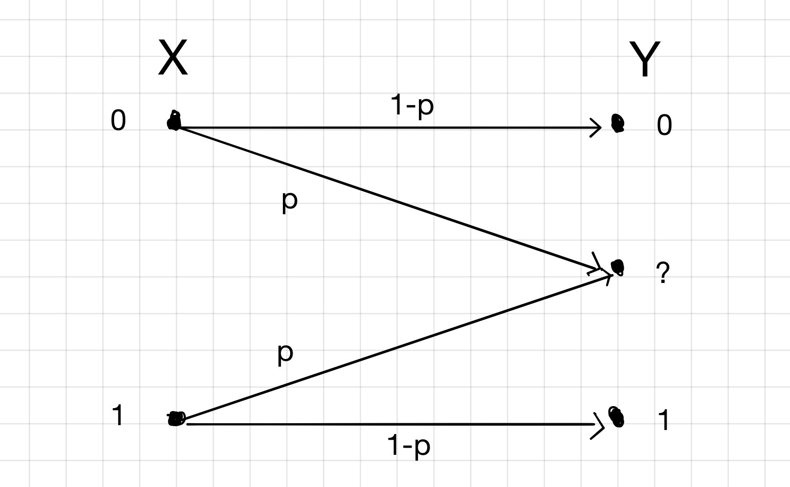

## Mathematical Model of a Channel:

Information can be transmitted via a plethora of channels like neural synapses, air, cosmic space, coaxial cable, a compact disc etc.

To model a channel, consider a function that takes as input an alphabet sequence $\\{a_1, a_2 \ldots, a_r\\}$ with probabilities $\\{p_1, p_2, \ldots, p_r\\}$, and returns as output another alphabet sequence $\\{b_1, b_2, \ldots, b_s\\}$, with probabilities $\\{q_1, q_2, \ldots, q_s\\}$. For the sake of simplicity, a binary model is assumed. But the theory will hold for other types of alphabets too.

>**Assumptions:**
>- There are no insertions or deletions made to the data by the Channel.
>- The Channel is memoryless. i.e. each output symbol does not depend on any of the past input symbols.
>- The transition probabilities of a given channel are constant. This statement means that the channel can not be altered. For example, in wireless transmission, the channel is air. We cannot alter air in such a way that the transmission probabilities are improved.

The transition probabilities of a channel are defined as:   
$$Q_{j|i} = P(Y=b_j|X=a_i)$$  

#### Binary Symmetric Channel(BSC):

This model is one of the most important examples of Channel Coding.

Let the input alphabets be `0` and `1` and possible output alphabets also be `0` and `1`. Then, here, $p$ is the probability that `1` is received as the output when `0` was transmitted, and vice-versa.

Hence, the probability of error $p$:
$$ \implies p = P(Y= 0 | X = 1) = P(Y=1|X=0) $$

This channel is called a symmetric channel because of the fact the $P(Y=0|X=1) = P(Y=1|X=0)$. In general, this is not always true. Hence, the transition matrix can be formulated as:
$$ Q = \begin{bmatrix} 1-p & p \\ p & 1-p \end{bmatrix}$$

Hence,
$$Q_{ij} = P(Y=i|X=j)$$
where $i, j \in \\{0, 1\\}$.  

#### Binary Erasure Channel(BEC):
There are channels that violate the first assumption we made above. One such channel is the Binary Erasure Channel(BEC).

As we can see, in this channel, `0` will be sent as `0` or will be erased, `1` can be sent as `1` or erased. Here, the transition matrix can be defined as:
$$ Q = \begin{bmatrix} 1-p & 0 \\ p & p \\ 0 & 1-p \end{bmatrix}$$  

Hence,
$$Q_{ij} = P(Y=i|X=j)$$  
where $i \in \\{0, ?, 1\\}$ and $j \in \\{0, 1\\}$.

In this article, all the calculations and derivations are performed assuming the BSC model, unless specified.

>As explained in the examples above the transition probability matrix $Q$ is constant. Inferentially, we have a direct control over $X$, but $Y$ depends on the channel. So, all the calculations in Channel Coding will make that assumption.

Typically, in the absence of encryption, the output of Source Coding is the input to Channel Coding.

### Why Channel Coding:

As we have seen above, the efficiency of the Channel is hard to control. So the central objective of Channel Coding is to pre-process the data in such a manner that **maximum** information is exchanged through the channel. Mathematically, we want to maximise $\mathbb I(X, Y)$.  
$$ \begin{align*} \mathbb I(X, Y) &= H(X) + H(Y) - H(X, Y) &\\
H(X) &= \sum_{i=1}^r p_i \log_2 \frac{1}{p_i} & p_i = P(X=a_i) \\
H(Y) &= \sum_{j=1}^s p_j \log_2 \frac{1}{p_j} & p_j = P(Y=b_j) \\
H(X, Y) &= \sum_{i=1}^r\sum_{j=1}^s R_{ij} \log_2 \frac{1}{R_{ij}} & R_{ij} = P(X=a_i, Y=b_j)
 \end{align*} $$   
where, $H(X)$ is the amount of information being sent at input, $H(Y)$ is the amount of information received at the output, $H(X, Y)$ is the Joint information and $\mathbb I(X, Y)$ is known as the **Mutual Information** between input and output, which represents the amount of information communicated from the sender to the receiver. Some  other applications of Mutual Information:
- While designing Artificial Neural Networks, wherein the maximum amount of information is communicated between the layers of the Network.  
- Stimulus response curves. $p_x$ and $p_y$ are given and $\mathbb I(X, Y)$ is to be maximised.

### Example: Binary Symmetric Channel (BSC)

Suppose in a BSC channel, the probability of error $p = 0.1$, and $p_0 = P(X=0) = 0.2$ and $p_1 = P(X=1) = 1-p_0 = 0.8$.  

Assume, `0` was received. Then:
$$\begin{align*} p_{00} = P(X=0|Y=0) &= \frac{P(X=0, Y=0)}{P(Y=0)} \end{align*}$$  
Applying *Bayes Theorem*,   
$$\begin{align*} p_{00} = P(X=0|Y=0) &= \frac{P(X=0) P(Y=0|X=0)}{P(X=0)P(Y=0|X-0) + P(X=1)P(Y=0|X=1)} \\
&= \frac{0.2 \times 0.9}{0.2\times0.9 + 0.8\times 0.1} \\
&= 0.69 \end{align*}$$  

The probabilities $P(X=0)$ and $p$ are independent. And $P(Y=0)$ and $P(Y=1)$ are two *mutually exclusive* events. Hence, their probabilities are added in the denominator.

Similarly,
$$p_{10} = P(X=1|Y=0) = \frac{0.8\times 0.1}{0.2\times 0.9 + 0.8\times 0.1} = 0.31$$   

Now, if `1` was received, then:
$$\begin{align*} p_{01} = P(X=0|Y=1) &= \frac{P(X=0)P(Y=1|X=0)}{P(X=0)P(Y=1|X=0)+P(X=1)P(Y=1|X=1)}\\
&= \frac{0.2\times 0.1}{0.2\times 0.1 + 0.8\times 0.9}\\
&= 0.027 \end{align*}$$  
And
$$p_{11} = P(X=1|Y=1) = \frac{0.8\times 0.9}{0.2 \times 0.1 + 0.8\times 0.9} = 0.973 $$  

Hence,  
$$\begin{align*} q_0 = P(Y=0) &= P(X=0)(1-p) + P(X=1)(p)\\
&= p_0(1-p) + p_1(p)\\
&= 0.2\times 0.9 + 0.8\times0.1\\
&= 0.26 \\
\text{And}\\
q_1 = P(Y=1) &= P(X=1)(1-p) + P(X=0)(p) \\
&= p_1(1-p) + p_0(p)\\
&= 0.8(0.9) + 0.2(0.1)\\
&= 0.74\end{align*}$$  
where, $p$ is the *probability of error*.

### Channel Capacity

The **Channel Capacity** of a channel can be defined as $C = \max_{p_0} \mathbb I(X, Y)$. Hence, for the above defined channel,   
$$\begin{align*}C &= \max_{p_0}\mathbb I(X, Y) \\
&=\max_{p_0} H(Y) - H(Y|X)\\
\text{Define $H_2(f)$ as}\\
H_2(f)&= f\log_2\frac{1}{f} + (1-f)\log_2\frac{1}{1-f} & f \in (0, 1)\\
\text{Then }\\
H(Y)&= H_2(p_0p + p_1(1-p))\\
H(Y|X) &= p_0H(Y|X=0) + p_1H(Y|X=1)\\
&= p_0H_2(p) + p_1H_2(p)\\
&= H_2(p)\end{align*}$$
$$\begin{equation}
\label{eq:ChannelCap}
\tag{1}
\implies C =\max_{p_0}H_2(p_0p + p_1(1-p)) - H_2(p)\end{equation}
$$
The second term in the above equation is constant. Hence we need to maximise the first term. The *Binary Entropy Function* $H_2(f)$ is maximum when $f=0.5$.   
$$\begin{align*}H_2(0.5) &= 0.5\log_2\frac{1}{0.5} + 0.5\log_2\frac{1}{0.5}\\
&= 1 \text{ bit}\end{align*}$$   
Now, in equation \eqref{eq:ChannelCap} when $p_0 = 0.5$,   
$$\begin{align*}H_2(p_0p + p_1(1-p)) &= H_2(0.5p + 0.5(1-p))\\
&= H_2(0.5)\\
&= 1\text{ bit}\end{align*}$$   

Therefore,
$$\begin{align*}C &= \max_{p_0}H_2(p_0p + p_1(1-p)) - H_2(p)\\
&= 1 - H_2(p) \text{ bits}\end{align*}$$

In BSC presented in the previous section,   
$$\begin{align*}H(X) &= p_0\log_2\frac{1}{p_0} + (1-p_0)\log_2\frac{1}{1-p_0}\\
&= 0.2\log_2\frac{1}{0.2} + 0.8\log_2\frac{1}{0.8}\\
&= 0.722 \text{ bits}\end{align*}$$   
And,   
$$\begin{align*}H(X|Y) &= \sum_{y\in Y}q_y H(X|Y=y)\\
&=\sum_{y \in Y} q_y(\sum_{x\in X}P(X=x|Y=y)\log_2\frac{1}{P(X=x|Y=y)})
\\&=q_0H(X|Y=0) + q_1H(X|Y=1)\\
&=q_0(p_{00}\log_2\frac{1}{p_{00}} + p_{10}\log_2\frac{1}{p_{10}}) + q_1(p_{10}\log_2\frac{1}{p_{10}} + p_{11}\log_2\frac{1}{p_{11}})\\
&= 0.26(0.69\log_2\frac{1}{0.69} + 0.31\log_2\frac{1}{0.31}) + 0.74(0.027\log_2\frac{1}{0.027} + 0.973 \log_2\frac{1}{0.973})\\
&= 0.26(0.89) + 0.74(0.18)\\
&= 0.365\text{ bits}\end{align*}$$   

Hence, **Channel Capacity** $C$ is:  
$$\begin{align*}C &= H(X) - H(X|Y)\\
  &= 0.722 - 0.365 \text{ bits}\\
  &= 0.357 \text{ bits}\end{align*}$$
