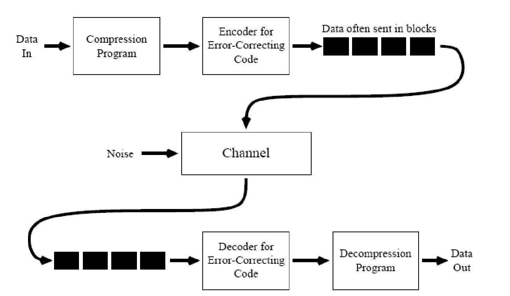
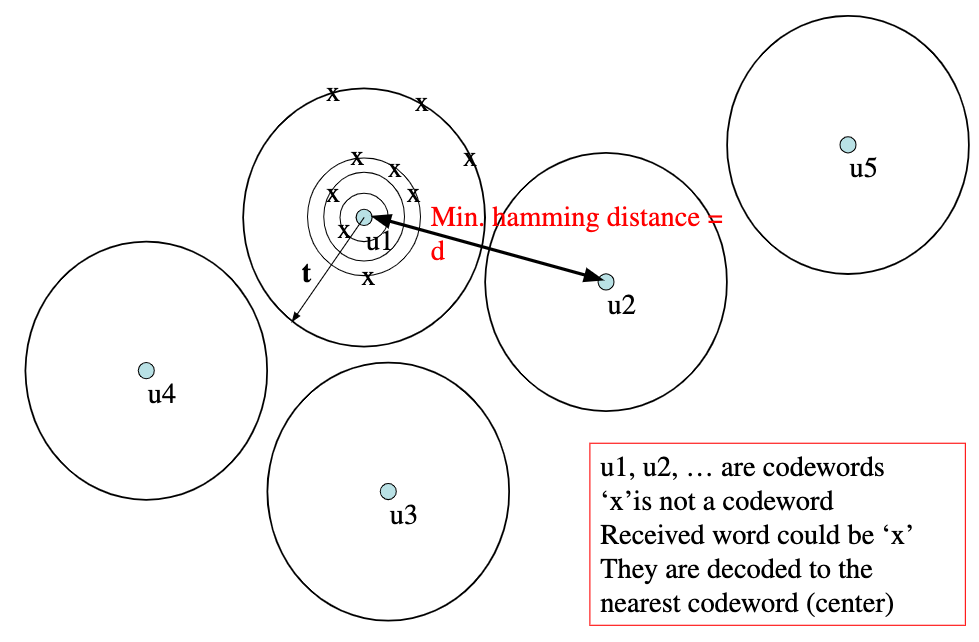
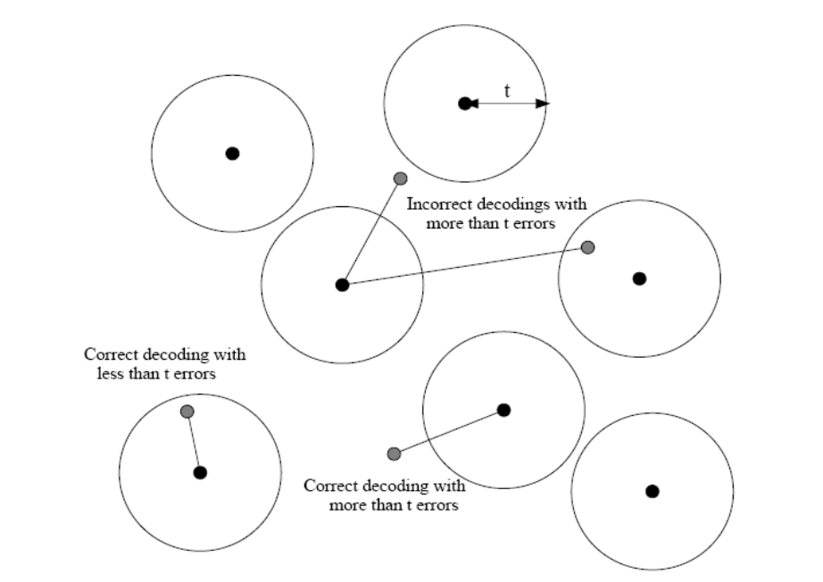
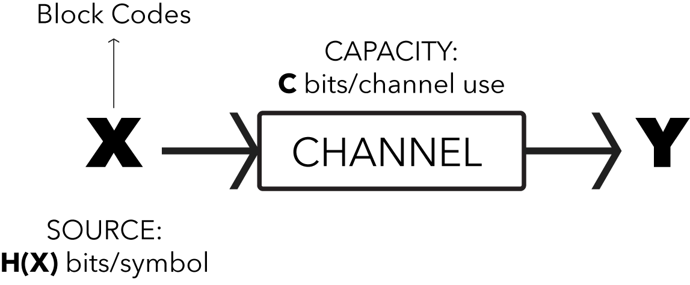

#### Recap:

**Channel Capacity:** Maximum possible amount of information that can be transmitted via the channel per use.     
$$C = \max_{p_0} \mathbb I(X, Y) $$    

Hence, the *SI* unit is `bits/channel use`.   

For a _Binary Symmetric Channel_(BSC), maximum channel capacity is    
$$ C = 1 - H_2(p)$$   
where $H_2(p)$ is the _Binary Entropy Function_    
$$ H_2(p) = p\log_2\frac{1}{p} + (1-p)\log_2\frac{1}{1-p}$$    

where $p$ is called the **error probability** or the **crossover probability**.    

**Channel Capacity for Binary Erasure Channel(BEC):**   

$$\begin{align*}
C &= \max_{p_x} \mathbb I(X, Y) \\
&= \max_{p_x} H(Y) - H(Y|X)
\end{align*}$$

Now, $H(Y|X) = H_2(p)$(see Lecture-8 for proof).   
$$\begin{align*}
q_0 = P(Y=0) &= p_0(1-p) \\
q_1 = P(Y=1) &= p_1(1-p) \\
q_? = P(Y=?) &= p(p_0 + p_1) = p \\
\end{align*}$$    
Then,   
$$
\begin{align*}
\implies H(Y) &= q_0\log_2\frac{1}{q_0} + q_1\log_2\frac{1}{q_1} + q_?\log_2\frac{1}{q_?} \\
&= -[p_0(1-p)\log_2 p_0(1-p) + p_1(1-p)\log_2p_1(1-p) + p\log_2p]\\
&= -\bigg[(1-p)\big[p_0(\log_2p_0 + \log_2(1-p)) + p_1(\log_2p_1 + \log_2(1-p)) \big] + p\log_2p\bigg]\\
&= \bigg[(1-p)H(p_0) + p_0H(1-p) + (1-p)H(p_1) + p_1H(1-p) + H(p)\bigg] \\
&= \bigg[(1-p)\big[H(p_0) + H(p_1)\big] + (p_0+p_1)H(1-p) + H(p)\bigg]\\
&= \bigg[(1-p)H_2(p_0) + H(1-p) + H(p)\bigg] \\
&= \bigg[(1-p)H_2(p_0) + H_2(p)\bigg]
\end{align*}$$    

Therefore,   
$$\begin{align*}
C &= \max_{p_0} H(Y) - H(Y|X)\\
&= \max_{p_0} \big((1-p)H_2(p_0) + H_2(p)\big) - H_2(p)\\
&= \max_{p_0} (1-p)H_2(p_0)\\
&= (1-p) \text{ bits/channel use}
\end{align*}$$    

## Designing Codes for Error Correction:

Data is typically sent in blocks.   

Hence, for designing a code, we shall map a block of input data into an output block. Error correction enabling bits are usually appended to the input data block. Probability of the occurrence of error is the same for all the bits of the output block. We hope that even after receiving the corrupt version of these blocks, we will be able to decode them into error free input message.   

For designing Codes, assume that the input data block is of size $k$ bits. The size of the output block as a result of encoding is $N$ bits. As logic suggests,    
$$ N > k $$   
because, you always want to  add some information to the input data so that later you can figure out which data blocks were in error.   

### Binary Codes:

Total possible number of $k$-bit input blocks: $2^k$   
Total possible number of $N$-bit output blocks: $2^N$   

However,  we know that only $2^k$ of these $2^N$ blocks are codewords, since there are only $2^k$ input blocks. Lets call the set of all possible codewords $\mathbb C$. Then, $\|\|\mathbb C\|\| = 2^k$.   

In the output block, $k$ bits contain the actual information and the remaining $N-k$ bits are the parity bits. The **rate** of a Code $\mathbb C$ is defined as $r = \frac{k}{N}$. A Code can be notated as $[N, k]$ or $[k, N]$.  

#### Example: Parity Bit:

Let's defined a binary encoder with $k=1$ such that:  
Input | Codeword
----- | --------
`0` | `00`
`1` | `11`           

Here, $N = 2$ bits, and the rate $r = k/N = 1/2 = 0.5$ bits/symbol.   

This code cannot correct any error, but can detect up to one bit error. Hence, in the received block, if there is an odd number of `1`'s, then we can claim the existence of an error.  

### Repetition Code $R_3$:

The $R_3$ Repetition Code can be defined as follows:   
Input Block | Output Block
----------- | ------------
`0` | `000`
`1` | `111`      

Here, $k=1$ bit, $N = 3$ bits, and the rate $r = k/N = 1/3$ bits/symbol.

> If rate is small, there are more parity bits in every Codeword, and as a result, more errors can be corrected. But it comes at an expense of losing compression since more bits are transmitted through the channel. Hence, for an optimal case, we want the rate $r$ to be as close to $1$ as possible, while having a commendable error correction performance.    

The $R_3$ Repetition Code can correct up to one bit error per block. For example, `0 1 1` is encoded as `000 111 111`. If the received message is `001 111 110`, we can just count the majority symbol in every block of the received message, resulting in the final output being `0 1 1`, which is the same as the input message.    

### Repetition Code $R_5$:

The $R_5$ Repetition Code can be defined as follows:   
| Input Block | Output Block |
| ----------- | ------------ |
| `0` | `00000` |
| `1` | `11111` |     

Here, $k=1$ bit, $N=5$ bits, and the rate $r = k/N = 1/5 = 0.2$ bits/symbol.    

The $R_5$ Repetition Code can correct up to two bit errors per received block. For example, `0 1 1` is encoded as `00000 11111 11111`. If the received message is `00101 11011 11001`, we can just count the majority symbol in every of the received message, resulting in the final output being `0 1 1`, which is same as the input message.    

### [2, 5] Code:

Lets define a [2, 5] Code such that:    
| Input Block | Output Block |
| ----------- | ------------ |
| `00` | `00000` |
| `01` | `00111` |
| `10` | `11001` |
| `11` | `11110` |       

As we can see, here, $k=2$ bits, $N=5$ bits, and the rate $r = k/N = 2/5 = 0.4$ bits/symbol.   

The [2, 5] code can *detect* up to two bit errors per block and *correct* up to one bit error per received block. For example, if the received message block is `00101`, the 'nearest' codeword in $\mathbb C$ is found. In this case, it is `00111`. Hence, this message block is decoded as `01`. The 'nearest' codeword here is found using the **Hamming Distance** metric.   

> **Probability of Error**: Lets say we have a BSC channel with $p=0.1$. Then the probability of a 5-bit error is $0.1^5=10^{-5}$, but the probabilities of a one bit error( $10^{-1}$) or a two bit error($10^{-2}$) are significantly higher.

### Hamming Distance:

The **Hamming Distance** $d(\textbf{u}, \textbf{v})$, where $\textbf{u}$ and $\textbf{v}$ are two binary codewords is the number positions in which $\textbf{u}$ and $\textbf{v}$ differ.     

For example, let $\textbf{u}$, $\textbf{v}$ and $\textbf{w}$ be three codewords such that:     
| Vector | codeword |
| ------ | -------- |
| $\textbf{u}$ | `011001101110` |
| $\textbf{v}$ | `011001010001` |
| $\textbf{w}$ | `011110010010` |      

Then, $d(\textbf{u}, \textbf{v})=6$, $d(\textbf{v}, \textbf{w})=5$ and $d(\textbf{u}, \textbf{w}) = 7$   

Basically, here we are calculating the $XOR$ of two codewords $\textbf{u}$ and $\textbf{v}$ and then counting the number of `1`'s in the resulting codeword. Therefore,      
$$d(\textbf{u}, \textbf{v}) = \#_{1's} (\textbf{u} \oplus \textbf{v})$$     

Each time a Code is designed, the minimum **Hamming Distance**($d$) between two consecutive codewords should be maximised to design an optimal error-correcting Code.    

#### What should be the minimum distance to correct $t$ errors?    

In the above figure, the centre of every circle represents a codeword. and the concentric circles are exactly $1$ Hamming distance apart from the codeword $\textbf{u}_i$. It is visible that the moment any of the two circles 'touch', there is problem, because the Hamming Distance of  $x$ is the same from two codewords.    

Hence, to be able to correct $t$ bit errors, you need a minimum Hamming distance $2t+1$ bits between two consecutive codewords.   

Similarly, to be able to detect $t$ bit errors, you need a minimum Hamming Distance of $t+1$ between two consecutive codewords.    

For example, in [2, 5] Codes, $d$ between two consecutive codewords is $3$. Hence,    
$$\begin{align*}
2t_1 + 1 &= 3\\
\implies t_1 &= 1
\end{align*}$$
Hence, [2, 5] Codes can correct up to one bit errors. And  
$$\begin{align*}
t_2 + 1 &= 3 \\
\implies t_2 &= 2
\end{align*}$$    
Hence, [2, 5] Codes can detect up to two bit errors.    

Sometimes, it is possible to correct more than $t$ errors. Refer image below:

## Shannon's Noisy Coding Theorem:

**Theorem Statement:**     
>  For any channel with capacity $C$, any desired error probability $\epsilon > 0$, and any transmission rate, $R < C$, there exists a code with some length $N$ having rate at least $R$ such that the probability of error when decoding this code by maximum likelihood is less than $\epsilon$.    

**Inference:** Once the channel capacity $C$ is known, a Code with rate $R$ can be designed such that $R<C$ and the probability of error is arbitrarily close to zero. In other words, we can transmit at a rate very close to channel capacity, with very small probability of error.     

Shannon's Theorem does not give us a way to design the code, but only that it exists.   

    

Every $T_s$ seconds, $\textbf{X}$ produces a symbol, and every channel use takes $T_c$ seconds. Then,   
$$\begin{align*}
\text{Information rate of $\textbf{X}$} &= \frac{1}{T_s} \text{ symbols/second} \times H(\textbf{X}) \text{ bits/symbol} \\
\text{Rate of Transmission} &= \frac{1}{T_c} \text{ channel use/second} \times \textbf{C} \text{ bits/channel use}
\end{align*}$$    

Hence, the **Noisy Channel Coding theorem** states that if $R\frac{H(\textbf{X})}{T_s} < \frac{\textbf{C}}{T_c}$, then, $\exists$ a Code $\mathbb C$ such that the probability of error $p_e < \epsilon$.   

And, as $N \to \infty$, $p_e \to 0$.     

Hence, if the rate of production of information is less than the rate if reliable transmission of information, then there exists a Code such that the probability of error in transmission approaches zero as the message block size approaches infinity.

So, this theorem is a pre-condition for defining 'Good Codes'. This theorem states that designing 'Good Codes' is possible, but designing 'Good Codes' is actually a hard problem.

For imagination, we can refer to the following analogies:    
- Imagine a water source that 'produces' water at the rate of $H(\textbf{X})$ litres/second. And this water flows through a pipe with maximum capacity $\textbf{C}$ litres/second. Now, if $H(\textbf{X}) > \textbf{C}$, there is no way that pipe can handle the source.
- You are typing a prose dictated by a friend. You have a maximum capacity of correctly typing $\textbf{C}$ words/second. And the speed at which your friend dictates is $H(\textbf{X})$ words/seconds. Now, if your friend dictates faster than your capacity to type correctly ($H(\textbf{X}) > \textbf{C}$), you are bound to make errors while typing.  

Typically, in practical applications, $H(\textbf{X})$ is assumed to be $1$ bit per symbol. So, we end up comparing the rate $R$ with the channel capacity $C$.   
