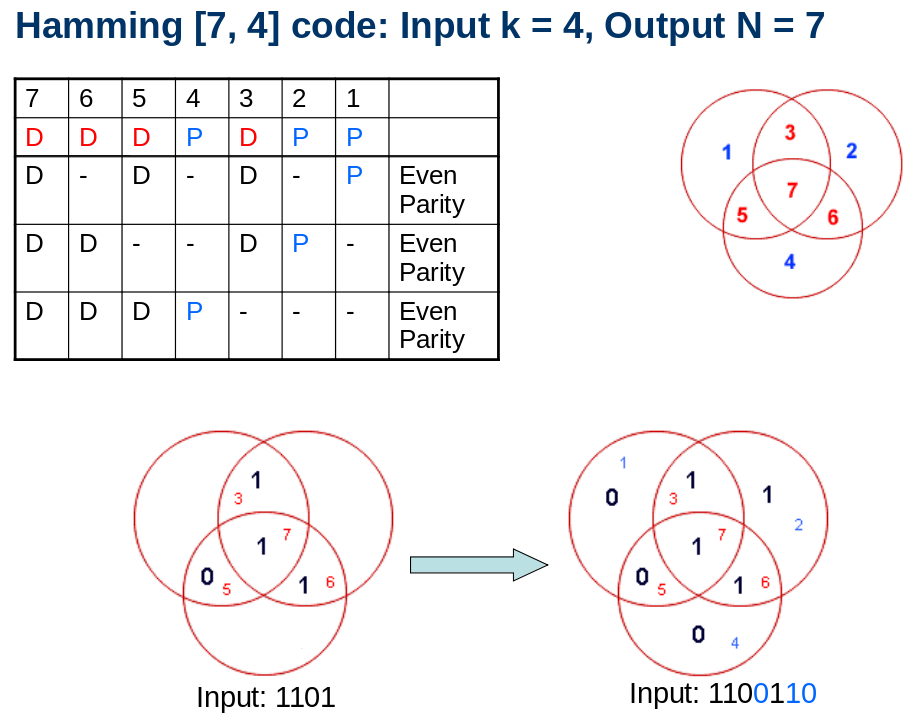
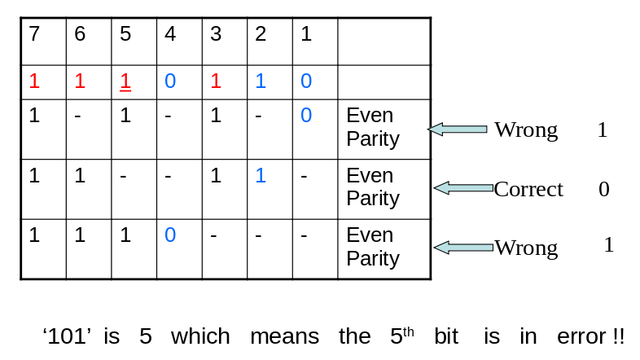
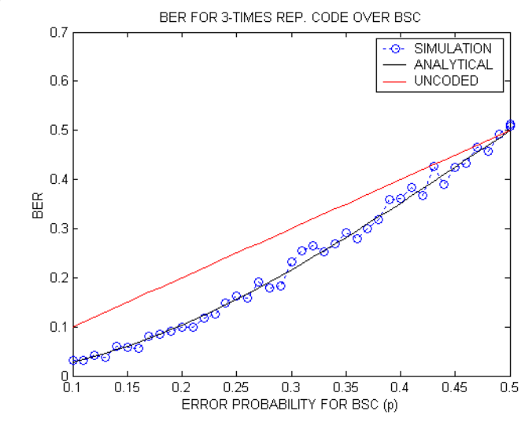

# Hamming Codes

### Introduction and motivation behind Hamming codes

Hamming was writing programs and there were programming errors. This was counter productive since these bugs were caught only after a long execution time. The motivation came from such experience to have codes which can detect and correct errors. Bell labs was a perfect place for innovations with people like Tukey (who came up with FFT), Bode etc. inhabiting the place at same time.

Hamming proposed [7,4] codes. Here the rate, $R = 4/7 = 0.5714$
If we compare this against the rate of repetition code R3 ($rate = 1/3 = 0.333$) it is better
Both of these correct only $1 bit$ error
Hamming distance, d = 3 for both the coding schemes

**Is it fair to make the statement that Hamming codes are better than R3 code?**
The block size is different in Hamming code and R3. Hamming code takes in 4 bits and output 7 bits, where as R3 code takes in 4 bits and output 12 bits
The 1 bit correction is happening over the block size. So, comparison of different schemes of code is not straight forward

Generally, the comparison is made using simulations of transmission over binary symmetric channel (BSC) and $iid$ source. One more common method is by computing error rates from analytical expressions

Hamming code is a fancy way of parity check. There are three parity bits.
We have total n bits of which k data bits are there. This means that $n-k$ parity bits are there
If we have to correct all $1 bit$ errors, how do we find $n$ and $k$

There are $n$ ways to have 1 bit errors and only $1$ way to have no errors
The $n-k$ parity bits should capture $n+1$ possible events

We will have $2^{n-k}$ states for the parity bits

So, for the parity bits to catch all one bit errors and no errors, it should satisfy the criteria

​														$2^{n-k} >= n+1$

|        k         |  n   | Rate |
| :--------------: | :--: | :--: |
| $2^{n-1} >= n+1$ |  3   | 1/3  |
| $2^{n-2} >= n+1$ |  5   | 2/5  |
| $2^{n-3} >= n+1$ |  6   | 3/6  |
| $2^{n-4} >= n+1$ |  7   | 4/7  |

What would a plot of $rate, k/n$ vs $n$ look like?

### Hamming code in action

Bits 3,5,6,7 are data bits are known. We are going from left to right when we lay out the data bits. The mathematical operation to get parity bit is **add and perform modulo 2 operation**

We could have padded the parity bits, k after 4 data bits also. But the trick/beauty of hamming codes is that we would be able to know the position/location of the error also

Let us demonstrate using an example:
The message transmitted is **1100110** and the message received is **1110110**

In the example, fifth bit is in error (only one bit error)
Now, we have to perform row wise parity check. If the computed parity is in agreement with the parity bit, we get a **zero**, if the calculated parity is not matching the parity bit, we get a **one** indicating wrong

We get 101 after this operation, which implies that fifth bit is in error. By checking the parity equations, we are able to locate the error (this error can be in data bits or parity bits)

We can make the fourth bit into 1 and follow the same procedure to get the parity equations pointing fourth bit location (100). The code is read bottom up

If we look at the table column wise, the number of ones tell us that all those rows should be wrong for that bit to be an error bit
For 7th column, all three parity equations has to be wrong. For column number 2, only middle row need to be wrong. So on and so forth. This is a true elegance of Hamming codes

In Hamming codes, the information and parity bits are mixed up. So reading the information is not straight forward compared to code schemes where parity bits are padded to information bits

#### The minimum distance of Hamming [7,4] code is 3

There are always $2^{k}$ codewords for $(n,k)$ hamming code
When we change one consecutive bit in input, we change the hamming distance by either 3 or 4

#### Hamming codes exist for $[2^m-1, 2^m-m-1]$ for all integers m>2

After [7,4] the next is [15,10]. Hamming codes are one bit error correction codes by design

### Performance evaluation of codes

First metric is **rate**. The rate of a code, $R = k/N$ should be closer to 1

Second metric is minimum distance, **d**. Higher the distance, more errors can be corrected. When d is larger, it implies that codewords are very well separated. Here the rate will suffer because $n$ also increases

Third is the probability of error or **BER** (bit error rate). This is computed after correction. In previous example, all the 2 bit or 3 bit errors can’t be corrected
	**BER = Number of bits in error after decoding**/**Total number of bits in the input message**

Fourth is **t**, the total number of errors it can correct in a block

### Analytical derivation of probability of error

For every n bits, what is the probability of error. In $R3$ code, $n=3$ and $k=1 $

Probability of error = $p^3 + 3p^2(1-p)$
p is the probability of error in binary symmetric channel (BSC). There is no memory in the channel

For $R5$ code, the probability of error would be $p^5+5p^4(1-p)+10p^3(1-p)^2$

**Probability of error for Hamming code[7,4] is	 $1$ -[${(1-p)^7+7(1-p)^6p}$]**
