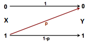
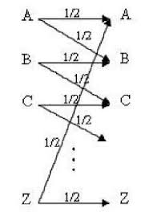

## Lecture No. 8, 9 & 10: Channels, Channel Capacity, BSC, BEC, Shannon's Channel Coding Theorem, Repetition codes, Hamming Codes

***[Deadline: March 27, 2020]***

*Instructions: Do not assume anything over and beyond what was defined in the class (unless explicitly asked in the assignment to do so or the theorem was stated but not proved in the class). Show your calculations in entirety. Justify all your answers with appropriate reasoning and arguments.*

1.  *Channel Capacity.* Determine the channel capacity of the following channels from first principles:

    - 

    - 

    - 

2.  *Uncoded BSC.* Simulate a Binary Symmetric Channel (BSC) with varying cross-over probability $p$ from $0.01$ to $0.50$. Plot the channel capacity of BSC for varying $p$. Assume that you are sending bits 0 and 1 from a binary i.i.d source with $p(0) = p_0$. You can run the simulation for at least 10000 bits as input to the BSC. For the simulated BSC, plot the probability of error (for the received bits) vs. cross-over probability $p$. Take three different settings: (a) $p_0 = 0.01$, (b) $p_0 = 0.25$ and (c) $p_0 = 0.499$.
    Write down your observations and insights.

3.  *Coded BSC.* For the simulated BSC, using binary Repetition codes $\mathbb R_3$ and binary Hamming code ($n=7, k=4$), plot the probability of error vs. cross-over probability for $p_0 = 0.25$ for at least 10000 input bits to the BSC before coding (after coding, this will expand). In the same graph, plot the analytically estimated probability of error. Compare this with the uncoded case. Write down your observations and insights. You can use in-built command/pre-existing package for Hamming code in MATLAB/Python/C etc.

4.  *Puzzle.* There are 12 identical balls -- identical in every regard. However, there is a suspicion that (at most) one of the  balls *may be* defective in weight - it could be heavier or lighter than the remaining 11 balls (or it could be the same weight as well). You are given a weighing balance but with no weights. You can however weigh balls against each other by placing them on either sides of the balance (you can put any number of balls on each side of the balance). What is the minimum number of weighs required to identify the defective ball (if it exists)? What is your strategy to find out which ball is defective (if it exists)?

5.  *Puzzle (extended).* Generalize the above problem for $m$ balls ($m$ is a positive integer $>1$). Give an expression for the minimum  number of weighs as a function of $m$. Is it possible to work out a
    general strategy for an arbitrary $m$? Can you connect this puzzle
    with error correction codes?

6.  *Shannon's Channel Coding Theorem.* A source $X$ emits one of two  symbols with probabilities $\{0.1, 0.9\}$ every 2 seconds. The channel is a BSC with error probability $p=0.1$ and is used every second. What is the critical rate of this channel? Does there exist   an error control coding scheme to transmit information of this source across BSC with an arbitrarily low probability of error?
    Design a coding scheme to reduce the probability of error $P_e < 0.05$.

7.  In the above problem, repeat the calculations but for the Binary Erasure Channel (BEC) instead of the BSC. Assume erasure probability as $p=0.1$.
