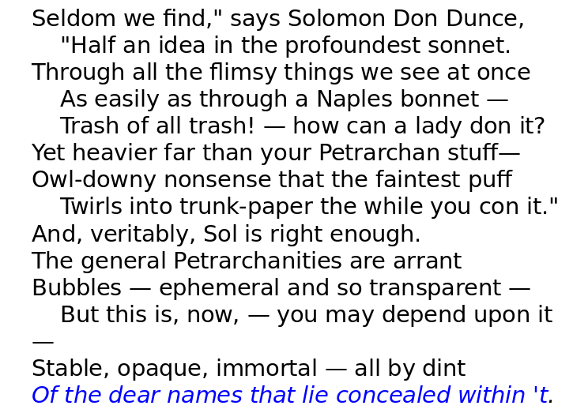

### Introduction

There are many scenario in real life where we would need to make the message secret either due to trust issues or the possibility of eavesdropping
Examples: Sending money to mother living in a distant place, Keeping secret information (Reference to Dan Brown’s Da Vinci Code), Storing passwords on computer etc.

Passwords cannot be exposed to anyone using the computer. How are passwords stored in a computer?
You don’t store the password at all! Only the hash value of passwords are stored.

Hash functions are one way functions. Hash functions are of the form, $y=f(x)$ and given $x$ we can find $y$, but from $y$ it is very very difficult to find $x$. Going one way is easy, but traversing the other way is difficult. As a generic example consider telephone directory. Say, I give you the name of the person, you can find his/her phone number very easily in less time. If I give you a phone number and you have to find the person, the only way is brute force search of entire directory from page 1 till last page.

Everyone can access the hash value, but finding the inverse is quite difficult (but not impossible)

### Overview

- A brief history of cryptography
- Recent trends in cryptography
- Break the code challenge

### History of Cryptography

In cryptography, the meaning of the message is hidden, but the message itself is not hidden
Historically, secret messages were often hidden. **Steganography** is about hiding messages

There are lots of folklore cryptography in literature. The spy would shave the head and messages are written on the head. Once the hair grows back, spy is ready to travel with the secret message

Edgar Allan Poe used to write steganographic sonnets. Try finding the message from the below sonnet. Here one point to note is there is no encryption only embedding of the message.

This is very common in watermarking. The information is not concealed. These are used for authentication. In music composition or digital art, watermarking is commonly used and can be used as a evidence in court of law in establishing ownership

Secret messages can be embedded in simple looking innocent websites or blogs

### Definitions

- **Cryptology** is the study of ciphers
- The message to be encrypted is called **plain text**
- The encrypted message is called **cipher text**
- Code making is called **Cryptography**
- Code breaking is called **Cryptanalysis**
- Chosen plain text attack - You chose the message and you know the cipher text. How do you figure out the algorithm used for encryption

### The Cryptography Problem

Say, Akbar wants to send some message to Birbal and usually there is some evil minister listening/eavesdropping. The channel through which the communication happens is not secure. So, all the messages are intercepted by the evil minister. How can Akbar transmit message to Birbal without anyone understanding the message? This is the **Cryptography problem**

Another analogy is cricket. Code making can be compared to batting, code breaking is like bowling. There is a constant battle between people who make code and people who break code. Once a weakness is found in the encryption algorithm, that method would never be used. There are standard bodies which authenticate the encryption algorithm just like umpires.

[The code book](https://simonsingh.net/books/the-code-book/) : How to make it,break it, hack it, crack it by Simon Singh and [wikipedia page](https://en.wikipedia.org/wiki/History_of_cryptography) on **History of Cryptography** are two good resources

### Timeline in Cryptography

Roughly we can think of 5 levels

	1. Classical cryptography (3200 BC - AD 400)
 	2. Medieval cryptography (400 Ad - 1800 AD)
 	3. 1800 to World War II cryptography
 	4. World War II cryptography
 	5. Modern cryptography (Mathematical and computing trends after 1949 AD)

Shannon’s paper came out in 1949 which ushered cryptography to new age

Before 1949 there was not much understanding about limits of encryption etc. Many new trends like DNA cryptography, public keys etc. came into being after 1970s.

### Ancient Cryptography

Most ancient civilisations had some forms of cryptography system. For example, some pottery making techniques were encrypted and stored and passed onto same family members only.

In Mahabharatha (800 BC) there are some beautiful examples of cryptography. The wax palace murder attempt and Vidura-Yudhishthira secret talk happening in Mlecchita Vikalpa dialect is an [example](https://drisyadrisya.blogspot.com/2006/01/cryptography-in-mahabharata.html). This is cited as proof of the prevalence of cryptographic methods in ancient India in the [book](https://books.google.co.in/books?id=SEH_rHkgaogC&pg=PA1000&lpg=PA1000&dq=chinese+cryptography+history&source=bl&ots=_2hrl9t0B1&sig=2LAjURo7zlj5YBoExJjZXbjDhNU&hl=en&sa=X&redir_esc=y#v=onepage&q=chinese%20cryptography%20history&f=false) by David Kahn about history of cryptography.

**Kerckhoffs's principle** states that the cipher should be secure even after everything about the system is known except the **key**

Cryptography techniques also improved as medium of communication also improved. From cave drawings, papyrus, pen and paper, computer based digital cryptography, quantum cryptography etc.

### Trivia

Invention of diode and Fast Fourier Transform revolutionised the way large circuits were built to store and transfer communication
Gauss is the actual inventor of idea of FFT
World war accelerated the needs for cryptography techniques (ENIGMA is a good example)
Marian Rejewski laid down foundations for Alan Turing to crack ENIGMA by building bombe
Bombe was an electromechanical computing machine which implemented nonlinear boolean equation solvers
Many pseudo random generators are chaotic but deterministic
Quantum tunnelling or analog circuits are used to generate true random numbers/patterns
