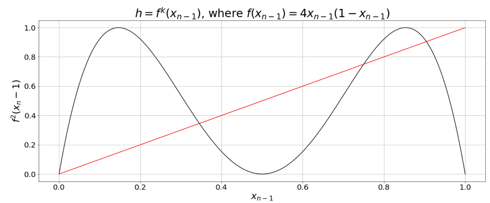
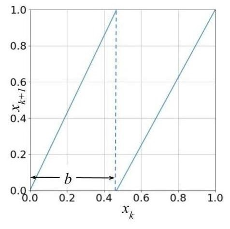
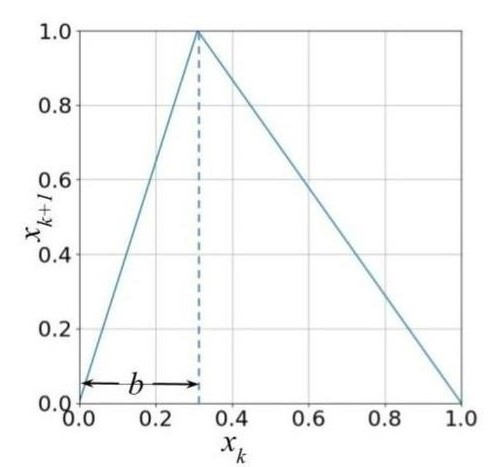

## Chaotic Dynamical Systems

### Recap

#### Definition of a map

A function ($f$) whose domain (input) space  and range (output) space is the same will be called as a **map**. Mathematically it is represented as $f: X \rightarrow X$.

#### Definition of orbit

Let $x$ be a point and let $f$ be a map. The orbit of $x$ under $f$ is the set of points $\{x, f(x), f^{2}(x), \ldots \}$. The starting point $x$ for the orbit is the initial value of the orbit. A point $p$ is a  **fixed point** of the map if $f(p) = p$.

In the case of $g(x) = 2x(1 -x)$, if $x = 0.5$ then $g(0.5) = 2* 0.5 (1 -0.5) = 0.5$  similarly $g(0) = 0$. Therefore $x = 0$ and $x = 0.5$ are the fixed points.

Another name for **orbit** of $x$ under map $f$ is **trajectory** of $x$ under the map $f$. Trajectory is denoted as follows:

$x_0 \rightarrow x_1 \rightarrow x_2 \rightarrow x_3  \cdots x_n$ where $x_n = f(x_{n-1})$, $n$ represents the number of iterations.

#### Cobweb Plot

 Cobweb plot is a graphical representation of the trajectory of $x$ under the map $f$. Cobweb plot helps to identify whether the fixed points are attracting or repelling.

#### To find the Fixed Points analytically

 Let us take the logistic model $x_{n} = f(x_{n-1})= 2x_{n-1}(1 - x_{n-1})$. Fixed points are those points where $2x_{n-1}^{\ast}(1 - x_{n-1}^{\ast}) = x_{n-1}^{\ast}$.

On simplifying,

$x_{n-1}^{\ast} - 2x_{n-1}^{\ast 2} = 0$.

$x_{n-1}^{\ast} = 0 , x_{n-1}^{\ast} = \frac{1}{2}$ are the fixed points.

#### To find the Fixed Points graphically

Step 1: Plot the map $f(x_{n-1}) = 2 x_{n-1} (1 - x_{n-1})$ with respect to $x_{n-1}$ where $x_{n-1} \in [0,1]$ and $f(x_{n-1}) \in [0, 1]$.

Step 2:  Plot $y = x_{n-1}$ in the same graph, the points where $y =x_{n-1}$ and $f(x_{n-1}) = 2x_{n-1}(1-x_{n-1})$ intersects are called the fixed points. Mathematically, this intersection is at $y = f(x_{n-1})$, it can also be written as $x_{n-1} = 2x_{n-1}(1 - x_{n-1})$.

<figure>

<figcaption>    Figure 1 - Left: Cobweb plot of $x_{n} = 2.5 x_{n-1} (1-x_{n-1})$ for an initial value $x_0 = 0.15$. Right: Trajectory for the initial value $x_0 = 0.15$ under the map  $x_{n} = 2.5 x_{n-1} (1-x_{n-1})$.</figcaption>
</figure>

### Stability of Fixed Points

The points near to a stable fixed point comes even closer to the fixed points as time progresses. Whereas in the case of an unstable fixed point, the points move farther from the unstable fixed point as time progresses.

A **fixed point** $p$ is called a *stable* or *sink* or *attracting fixed point* if there is an $\epsilon > 0 $ such that for all $x$ in the epsilon neighbourhood $N_{\epsilon}(p)$, $\lim_{k \to \infty} f^{k}(x) = p$.

$N_{\epsilon}(p)$ is the interval of numbers $\{x\in R: \|x - p\|< \epsilon\}$.  In other words, $p - \epsilon < x < p + \epsilon$.

If the points close to the neighbourhood of $p$ are repelled from $p$ then $p$ is called a *unstable* or *source* or *repelling fixed points*. Figure 2  provides an intuition to formulate the condition for stability.

<figure>

<figcaption>Figure 2 - A diagram to explain the stability of fixed points.</figcaption>
</figure>

From the definition of attracting fixed point we have, $\lim_{k \rightarrow \infty }f^{k}(x) = p$. This implies $f^{k}(x)$ is closer to $p$ (for some arbitrary $k$) than $f^{k-1}(x)$. In other words (From Figure - 2), $f(x)$ is closer to $p$ than $x$, This implies the following:
$$
|f(x) - p| < |x-p|, \\
\frac{|f(x) - p|}{|x - p|} < 1,\\
\lim_{x \rightarrow p }\frac{|f(x) - p|}{|x - p|} < 1,\\
|f^{'}(x)|_{x= p} < 1.
$$

For a repelling fixed point, $f(x)$ is farther to $p$ than $x$. The condition for repelling fixed point is as follows:
$$
|f(x) - p| > |x-p|, \\
\frac{|f(x) - p|}{|x - p|} > 1,\\
\lim_{x \rightarrow p }\frac{|f(x) - p|}{|x - p|} > 1,\\
|f^{'}(x)|_{x = p} > 1.
$$

#### Second Return map
The second return map is given by $f(f(x_n-1)) = f^{2}(x_n-1)$. The cobweb plot is plotted with respect to $f^{2}(x_{n-1})$ vs. $x_{n-1}$. The second return map of $f(x_{n-1}) = 4x_{n-1}(1-x_{n-1})$ is provided in Figure 3.

<figure>

<figcaption>Figure 3 - Second return map of $f(x_{n-1}) = 4x_{n-1}(1-x_{n-1})$.</figcaption>
</figure>
#### Fixed points of second return map

The fixed points of the second return map can be found using : $f^{2}(x) = x$. In the case of $f(x) = 4x(1-x)$, the second return map provided in Figure 3 intersects the line $f(x) = x$ at $4$ points. Out of the $4$ points $2$ points ($x= 0,x = \frac{3}{4}$) are period one or fixed points of $f(x) = 4x(1-x)$.

#### Stability of second return map

The stability of fixed points for second return map is as follows:
$$
\biggl|\frac{d (f^{2}(x_0))}{dx}\biggr| <  1,\\
|f^{'}(f(x_0))f^{'}(x_0)| = |f^{'}(x_1)f^{'}(x_0)| < 1.
$$

We have applied chain rule in the above. Thus, for an $n$-th return map the stability analysis is as follows:
$$
 |f^{n^{'}}(x_0)| = |f^{'}(x_0)||f^{'}(x_1)||f^{'}(x_2)|\ldots |f^{'}(x_{n-1})| < 1 ~~\text{ Stable fixed point},\\
      |f^{n^{'}}(x_0)| = |f^{'}(x_0)||f^{'}(x_1)||f^{'}(x_2)|\ldots|f^{'}(x_{n-1})| > 1 ~~\text{ Unstable fixed point}.
$$

### Binary Map

We consider the map $f(x) = 2x \mod 1$. Figure 4 represents the binary map.

<figure>

<figcaption>Figure 4 - Binary map $f(x_{n-1}) = 2x_{n-1} \mod 1$.</figcaption>
</figure>

Consider two very close initial values $x_0$ and $x_0^{'}$, where $x_0^{'} = x_0 + \delta x_0$. Now find the trajectory of $x_0$ and $x_0^{'}$ under the map $f(x_{n-1}) = 2x_{n-1}\mod 1$. **What happens to magnitude of $\delta x_0$ over time?**

$\delta x_0 = |x^{'}_0  - x_0|$.
Assume that all the iterates ($x_0 \rightarrow x_1 \rightarrow \ldots x_n$ and $x^{'}_0 \rightarrow x^{'}_1 \ldots x^{'}_n$) are on the left branch of the $2x\mod 1$ map. Now we have the following:

$$
\delta x_n = |x^{'}_n - x_n| = |2x^{'}_{n-1} - 2x_{n-1}| = 2|x^{'}_{n-1} - x_{n-1}| = 2\delta x_{n-1}.
$$

We can trace back the above to its initial conditions ($x_0$ and $x^{'}_0$). This is as follows:
$$
 \delta x_n = 2\delta x_{n-1} = 2^{2}\delta x_{n-2} = 2^{3}\delta x_{n-3} = \ldots = 2^{n}\delta x_{0}.
$$

We can write $2^{n} = e^{n\ln(2)}$, Substituting for $2^{n}$, we get the following:
$$
\delta x_n := e^{n\ln(2)}\delta x_0.
$$
In the above equation, $\ln(2)$ represents the rate of expansion at every iteration. In general for any 1D map, we have the following:
$$
   \delta x_n := e^{n\lambda(x_0)}\delta x_0.
$$

$\lambda(x_0)$ is defined as the local **lyapunov exponent** (PhD thesis of Lyapunov - 1982).

### How to find the Lyapunov Exponent ?

$$
\delta x_n = e^{n\lambda(x_0)}\delta x_0,\\
    e^{n\lambda(x_0)} = \frac{\delta x_n}{\delta x_0},\\
    n\lambda(x_0) = \ln\biggl(\frac{\delta x_n}{\delta x_0}\biggr),\\
    \lambda(x_0) = \lim_{n \rightarrow \infty} \lim_{\delta x_0 \rightarrow 0} \frac{1}{n}\ln\biggl(\frac{\delta x_n}{\delta x_0}\biggr).
$$

Here $n \rightarrow \infty$ means we look at infinitely long trajectories and $\delta x_0 \rightarrow 0$ implies we look at infinitesimally close points $x_0$ and $x^{'}_0$. On further simplification, we get the following:
$$
   \lambda(x_0) = \lim_{n \rightarrow \infty} \lim_{\delta x_0 \rightarrow 0} \frac{1}{n}\ln\biggl(\frac{|f^{n}(x_0 + \delta x_0) - f^{n}(x_0)|}{\delta x_0}\biggr),\\
     \lambda(x_0) = \lim_{n \rightarrow \infty} \lim_{\delta x_0 \rightarrow 0} \frac{1}{n}\ln\biggl|\biggl(\frac{df^{n}(x)}{dx}\biggr)\biggr|_{x = x_0}.
$$

Here $f(x) = 2x \mod 1$ (binary map defined earlier). Now we apply chain rule.
$$
 \biggl|\frac{df^{n}(x)}{dx}\biggr|_{x = x_0} = f^{'}(x_{n-1})f^{'}(x_{n-2})\ldots f^{'}(x_{0}).
$$

Now applying the above, we get the following:
$$
\lambda(x_0) = \lim_{n \rightarrow \infty} \lim_{\delta x_0 \rightarrow 0} \frac{1}{n}\ln \prod_{i = 0}^{n-1}|f^{'}(x_i) |,\\
    \lambda(x_0) = \lim_{n \rightarrow \infty} \lim_{\delta x_0 \rightarrow 0} \frac{1}{n}\ln \sum_{i = 0}^{n-1}|f^{'}(x_i) |.
$$

The local lyapunov exponent is defined as the follows:
$$
 \lambda(x_0) = \lim_{n \rightarrow \infty} \lim_{\delta x_0 \rightarrow 0} \frac{1}{n}\ln \sum_{i = 0}^{n-1}|f^{'}(x_i) |.  
$$

$\lambda(x_0) > 0$ implies expansion or divergence and $\lambda(x_0) < 0$ implies contraction or convergence. In certain cases the above limit ($n \rightarrow \infty$) does not exist, then it means the local lyapunov exponent does not exist.

In the case of binary map $\lambda(x_0) = \lambda_{t} = \ln(2)$. $\lambda_{t}$ is the temporal version of lyapunov exponent. Now can we find the lyapunov exponent spatially. To answer this, we need to understand global luapunov exponent.

#### Global Lyapunov Exponent

The spatial/global lyapunov exponent is defined as:
$$
 \lambda_e := \mathbf{E}[|\ln(|f^{'}(x)|)].
$$

The above is also called ensemble average. Since we are taking the average along the spatial variable $x$ and not the time variable $t$, we call the ensemble average as the spatial lyapunov exponent. The $x$ is going to vary over the domain $J$. In the case of binary map, the domain $J$ is the interval $[0,1]$. On further simplification we get the following:
$$
\lambda_e = \int_J \ln (|f^{'}(x)|)p(x)dx.
$$

$p(x)$ is the steady state distribution of the ensemble.

In the case of skew tent map, provided in  Figure 5 and binary map provided in Figure 4, the steady state distribution is an invariant probability distribution which is a uniform distribution.

<figure>

<figcaption> Figure 5 - Skew Tent map.
</figcaption>
</figure>
The equation for the tent map provided in Figure 5 is as follows:
$$
f(x)  =  \left\{\begin{matrix}
\frac{x}{b}&, ~~~~ 0 \leq x < b, \\
\frac{(1-x)}{(1 - b)}&, ~~~~ b \leq x < 1,
\end{matrix}\right. \\
$$

where $x \in [0,1)$ and $0 < b <1$. In the case of tent map  (Figure 5), the global lyapunov exponent is as follows:
$$
 \lambda_e = \int_J \ln (|f^{'}(x)|)p(x)dx,\\
    \lambda_e = \int_0^{b} \ln \biggl(\biggl|\frac{1}{b}\biggr|\biggr)p(x)dx + \int_b^{1} \ln \biggl(\biggl|\frac{1}{b-1}\biggr|\biggr)p(x)dx,\\
    \lambda_e =  \ln \biggl(\biggl|\frac{1}{b}\biggr|\biggr) b +  \ln \biggl(\biggl|\frac{1}{b-1}\biggr|\biggr) (1 - b).
$$

Substituting $b = \frac{1}{2}$ in the above we get the following:
$$
\lambda_e =  \ln (|2|) \frac{1}{2} +  \ln (|2|) \frac{1}{2},\\
   \lambda_e = \ln(2).
$$
   The equation of binary map ($2x\mod 1$) provided in Figure 4} is as follows:

$$
f(x)  =  \left\{\begin{matrix}
\frac{x}{b}&, ~~~~ 0 \leq x < b, \\
\frac{(x-b)}{(1 - b)}&, ~~~~ b \leq x < 1,
\end{matrix}\right. \\
$$
where $x \in [0,1)$ and $0 < b <1$. In the case of binary map provided in Figure 4 the global lyapunov exponent is as follows:
$$
 \lambda_e = \int_J \ln (|f^{'}(x)|)p(x)dx,\\
    \lambda_e = \int_0^{b} \ln \biggl(\biggl|\frac{1}{b}\biggr|\biggr)p(x)dx + \int_b^{1} \ln \biggl(\biggl|\frac{1}{1-b}\biggr|\biggr)p(x)dx,\\
    \lambda_e =  \ln \biggl(\biggl|\frac{1}{b}\biggr|\biggr) b +  \ln \biggl(\biggl|\frac{1}{1-b}\biggr|\biggr) (1 - b).
$$

Substituting $b = \frac{1}{2}$ in the above we get the following:
$$
\lambda_e =  \ln (|2|) \frac{1}{2} +  \ln (|2|) \frac{1}{2},\\
   \lambda_e = \ln(2).
$$

​    So for binary map and tent map, $\lambda_e$ (spatial (global) lyapunov exponent) = $\lambda_t(x_0)$ (local lyapunov exponent) =  $\ln(2) $ (almost everywhere). This implies both  tent map and binary map are **ergodic**. For ergodic maps, the following is true:

$$
\lambda_e = \lambda_t(x_0) = \lambda
$$

### Chaos in the sense of Lyapunov

An ergodic map $F: J \rightarrow J$, $J \subseteq \mathbf{R}$ and $F$ which is differentiable is said to be chaotic in the sense of lyapunov if $\lambda >  0$. $\lambda > 0$ implies sensitive dependence on initial conditions. Lyapunov exponent measures the degree of chaos, the larger the lyapunov exponent ($\lambda > 0$) $F$ is strongly chaotic.   
