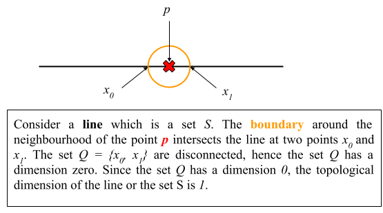
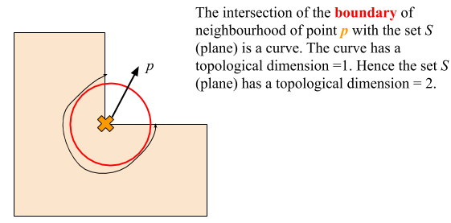
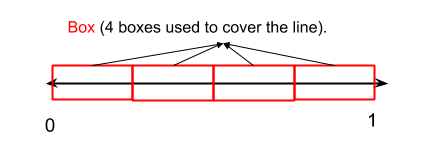
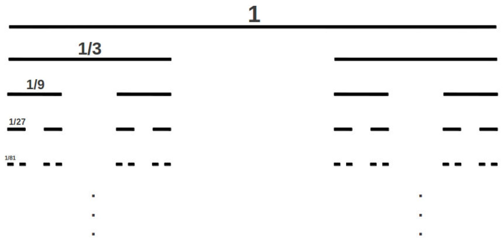
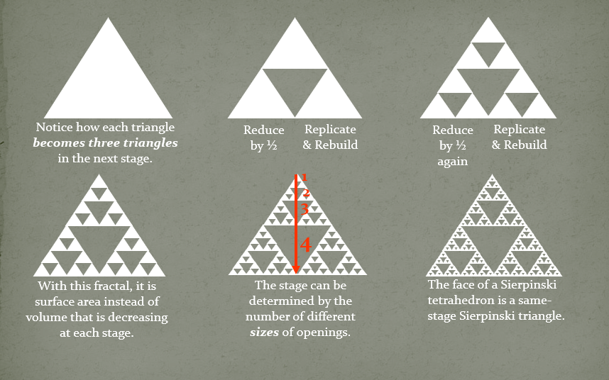
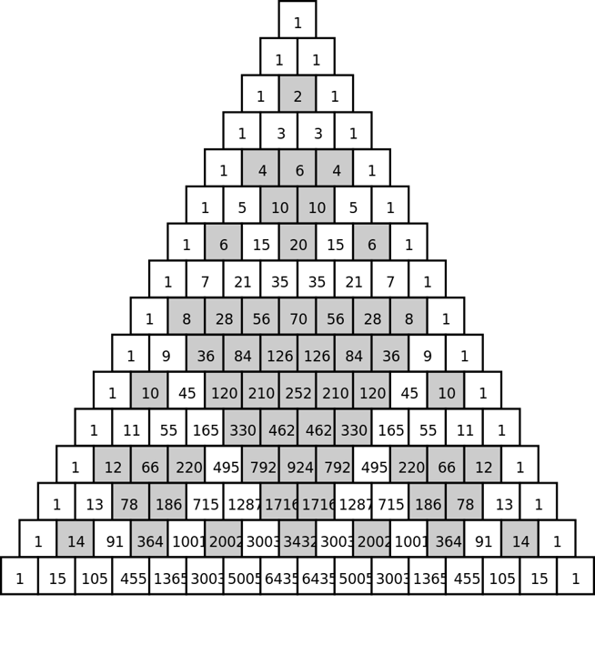
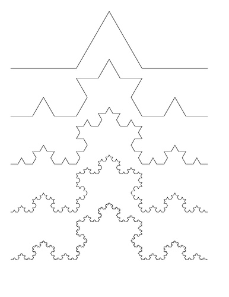

## Definition of Fractal

**Fractal**:  A *fractal* is a subset of $R^n$ which is self similar and whose fractal dimension in greater than the topological dimension. Some examples are provided in Figure 1.

### Self Similarity, Topological Dimension and Fractal Dimension

**Does self similarity is a necessary and sufficient condition for fractal?**

​                                                                  Figure 1: Fractals in daily life.

Self similarity - The components of a subset which when scaled produce original set $S$. Then the set $S$ is called self similar (scale invariance). For example consider a line between 0 and 1. Let this line be a set $S$. The subset of this line when scaled appropriately yields the same line. Does that mean line is a fractal? Line is not a fractal. Inorder to understand the definition of fractal we need to understand topological dimension and fractal dimension. Hence self similarity is a necessary but not a sufficient condition for a set to be fractal.

In the case of line the fractal dimension and topological dimension are the same. From the definition of fractal, a line cannot be a fractal.

### Inductive Definition of Topological Dimension

In the inductive definition, we first define for $K = 0$ dimension. Following that we define for $K = n$ dimension assuming that n-1 dimension exist.

**Zero Topological Dimension**: A set has a topological dimension of 0 if every point in the set has a arbitrary small neighbourhood whose boundaries do not intersect.

**n-Topological Dimension**: A set $S$ has a topological dimension $n$, if each points in $S$ has arbitrary small neighbourhoods whose boundaries meet the set $S$ in a set of topological dimension $n-1$ and $n$ is the least non-negative integer for which this is true.

​                                                 Figure 2. Topological dimension of a line.

Figure 2 provides the intuition for topological dimension of line to be 1.

​                                        Figure 3. Topological dimension of a plane.

Figure 3 provides the intuition for topological dimension of plane to be 1.

### Fractal Dimension

Fractal dimension is not uniquely defined. There are different notions of fractal dimension. The following are some of the notions:

1. Box counting dimension
2. Information dimension
3. Correlation dimension
4. Higuchi dimension
5. Lyapunov dimension
6. Multifractal dimensions
7. Hausdorff dimension
8. Uncertainty exponent
9. Packing dimension
10. Local connected dimension
11. Assouad dimension

In this lecture, we will study **box counting dimension**.

Let us consider a line (set $S$) from 0 to 1. Suppose we need to cover this line (set $S$) using another line/box. How many boxes are required to cover the line? What are the sizes of boxes used to over the line.

Consider the example in Figure 4. In this example we used four boxes each of length $\frac{1}{4}$ to cover the line (set).

​                           Figure 4. Four boxes each of length $\frac{1}{4}$ is used to cover the line from 0 to 1.

Instead $\frac{1}{4}$, we can use any arbitrary length boxes to cover the line. As box length decreases, the number of boxes increases. We represent box size as $\epsilon$ and the number of boxes as $N(\epsilon)$. Table 1, represents the number of boxes required to cover the line from 0 to 1 for varying box length.

​                                   Table 1: Box counting dimension for a line from 0 to 1.

| # of boxes ($N(\epsilon)$) | box size ($\epsilon$) |
| -------------------------- | --------------------- |
| 1                          | 1                     |
| 2                          | $\frac{1}{2}$         |
| 4                          | $\frac{1}{4}$         |
| $\vdots$                   | $\vdots$              |
| $2^{n}$                    | $\frac{1}{2^{n}}$     |

From Table 1, we can infer that the number of boxes is inversely proportional to the box size.
$$
  N(\epsilon) \sim \epsilon^{-D}
$$
where $D$ is the box counting dimension. $D$ is the exponent by which the number of boxes increases as the size of the boxes decreases.
$$
\log(N(\epsilon)) = -D\log(\epsilon)\\
     D = \lim_{\epsilon \rightarrow 0}\frac{\log(N(\epsilon))}{\log(\frac{1}{\epsilon})}
$$
In the above equation, $\epsilon \rightarrow 0$ also means $n \rightarrow \infty$. Hence the above equation can be written as follows:
$$
 D = \lim_{\epsilon \rightarrow 0}\frac{\log(N(\epsilon))}{\log(\frac{1}{\epsilon})} =  \lim_{n \rightarrow \infty}\frac{\log(N(\epsilon))}{\log(\frac{1}{\epsilon})}
$$
Now let us find out the box counting dimension of the line from 0 to 1.
$$
D =  \lim_{n \rightarrow \infty}\frac{\log(2^{n})}{\log(2^{n})}
D = \lim_{n \rightarrow \infty}\frac{n\log(2)}{n\log(2)} = 1
$$
Hence, the box counting dimension of the line ($D$) = 1. For a line, we have already shown the topological dimension is 1. Therefore, a line is not a fractal even though it is self similar.

## Examples of Fractals and its Fractal and Topological Dimension

### Cantor Set

Let us take a line and remove the middle part so the length 1 is divided into $[\frac{1}{3}, \frac{1}{3}, \frac{1}{3}]$. Now take the left and right part (middle part is removed) and again remove the $\frac{1}{3}$-rd middle part of left and right lines. Repeat this process for infinite number of iterations. We get the following Figure 5 when done infinite number of times.

​                                                                          Figure 5. Cantor Set.

Is there an interval, when we repeat the process to infinity?

To answer this, we have to calculate how much length is removed on each iterations. Let us denote the final length remaining after infinite number of iteration to be $d_f$
$$
d_f = 1 - \frac{1}{3} - \frac{2}{3^2} - \frac{4}{3^3} \ldots\\
d_f =  1 - \sum_{i = 1}^{ \infty}\frac{2^{i-1}}{3^{i}}\\
d_f = 1 - 1 = 0
$$
The finite length ($d_f$) = 0, implies that there is no interval when we iterate infinite number of times. At infinity all intervals are lost and we have a disconnected set of points. Whenever there is a set of disconnected points, the topological dimension of that set is zero.

Now what is the fractal dimension of cantor set?
For this we have to go back to box counting dimension. If we use a box size of $\frac{1}{3}$, then with $2$ boxes we can cover the line (middle $\frac{1}{3}$-rd is removed). Table 2 provides the number of boxes required to cover the line for varying box sizes.

​                                         Table 2: Box counting dimension for Cantor set.

| # of boxes ($N(\epsilon)$) | box size ($\epsilon$) |
| -------------------------- | --------------------- |
| 2                          | $\frac{1}{3}$         |
| 4                          | $\frac{1}{9}$         |
| 8                          | $\frac{1}{27}$        |
| $\vdots$                   | $\vdots$              |
| $2^{n}$                    | $\frac{1}{3^{n}}$     |

The box counting dimension for Cantor set is as follows:
$$
D =  \lim_{n \rightarrow \infty}\frac{\log(2^{n})}{\log(3^{n})}
D = \lim_{n \rightarrow \infty}\frac{n\log(2)}{n\log(3)} = 0.63
$$
The box counting dimension (fractal dimension) for cantor set is greater than the topological dimension of cantor set. Therefore, cantor set is a fractal.

### Sierpi\'nski triangle

####  Deterministic method

The procedure to generate the Sierpi\'nski triangle using deterministic method is provided in Figure 6.

​                                                                   Figure 6: Sierpi\'nski triangle.

####  Pascals Triangle

Pascals triangle contains the binomial coefficients of $(a + b )^{n}$. The first row in Figure 7 corresponds to the binomial coefficients of $(a+b)^{0}$. The $k-th$ row corresponds to the binomial coefficients of $(a+b)^{k-1}$.
In the pascals triangle, mark the position of odd numbers as white and the remaining mark the remaining even number position as grey. This will produce the Sierpi\'nski triangle.

​                               Figure 7: Generation of Sierpi\'nski triangle using Pascal's triangle.

#### Chaos Game

The Sierpi\'nski triangle can be generated using chaos game. The steps to generate the Sierpi\'nski triangle are as follows:

1. Consider three vertices of an equilateral triangle. Let the vertices be A, B and C.
2. Now consider a random point $p_1$. Compute the midpoint of the line joining $p_1$ with any of the vertices. For example, consider the vertex A. Compute the midpoint of line joining the point $p_1$ and the vertex A. Let the new point (midpoint) be $p_2$. Now from $p_2$ compute the midpoint of the line joining $p_2$ with any vertex of the triangle.
3. Repeat the step 2 infinite number of times. (Note: On each iteration, the choice of vertices should be chosen randomly.
4. Store the midpoints of each iterations in an array.
5. After $n$ iterations (ideally $n \rightarrow \infty$), we have a 2D array of length n. Remove the first 100 transients from this array. Plot the resultant 2D array after removing the transients.

#### Topological Dimension

The intersection of the boundary of neighbourhood of any point $p$ with the set (points in Sierpi\'nski triangle) is a disconnected set of points. Any disconnected set of points have a topological dimension of zero. Hence the topological dimension of Sierpi\'nski triangle is 1.

#### Box Counting Dimension

​                                 Table 3: Box counting dimension for Sierpi\'nski triangle.

| # of boxes ($N(\epsilon)$) | box size ($\epsilon$) |
| -------------------------- | --------------------- |
| 1                          | 1                     |
| 3                          | $\frac{1}{2}$         |
| 9                          | $\frac{1}{4}$         |
| $\vdots$                   | $\vdots$              |
| $3^{n}$                    | $\frac{1}{2^{n}}$     |

The box counting dimension for Sierpi\'nski triangle is as follows:
$$
D =  \lim_{n \rightarrow \infty}\frac{\log(3^{n})}{\log(2^{n})}
D = \lim_{n \rightarrow \infty}\frac{n\log(3)}{n\log(2)} = 1.584
$$
The box counting dimension (fractal dimension) for Sierpi\'nski triangle is greater than the topological dimension of Sierpi\'nski triangle. Therefore Sierpi\'nski triangle is a fractal.

### Koch Curve

Let us take a line and break the middle part and make it like a hill so the length 1 is divided into $[\frac{1}{3}, \frac{1}{3}, \frac{1}{3}]$. Now take the left part (excluding the hill we made earlier) and again break it. Repeat this process for infinite number of iterations. Now imagine a ant who wants to travel from one end to other end. How much distance should it cover? It turns out that if we iterate the steps countably infinite number of times then the distance ant has to cover becomes infinity. The length becomes infinite. Figure 8 shows the Koch curve. The box counting dimension and topological dimension of Koch curve is 1.26 and 1 respectively.

​                                                                     Figure 8: Koch Curve.

## Further Reading

1. Barnsley, Michael F. *Fractals everywhere*. Academic press, 2014.
2. Fractals in Ramanujan's work: https://www.scientificamerican.com/article/mathematics-ramanujan/
