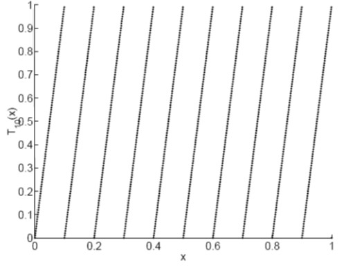
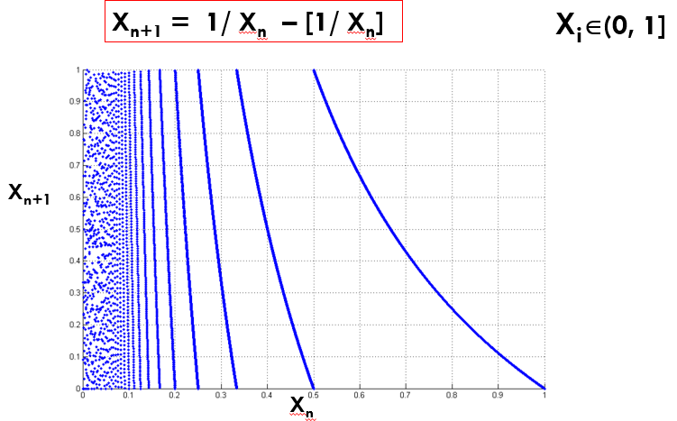

### Chaos in ECG Signals

To model the dynamics of ECG signals from heart, we use differential equations. Since we doesn't know the actual governing equation that generates the ECG signal, we model using differential equations. Here the differential equations are mathematical metaphors for the actual dynamics of ECG signals. The output data obtained using mathematical metaphors should capture the dynamics of actual phenomena within an error margin. These non-linear differential equations exhibit chaos. The Lyapunov exponent of the RR intervals or ECG signal is positive. This implies it is chaotic. Also, an healthy heart is found to be chaotic. This has been investigated in the paper :*Is the normal heartbeat chaotic or homeostatic?* by AL Goldberger. The reference to the paper is below:

1.  Goldberger, Ari L. "*Is the normal heartbeat chaotic or homeostatic?*." Physiology 6.2 (1991): 87-91.

### Chaos in the Brain

Researchers have found extensive empirical evidence of chaotic behaviour at various spatiotemporal scales of brain dynamics. The following papers supports this:

1. Korn, Henri, and Philippe Faure. "*Is there chaos in the brain? II. Experimental evidence and related models.*" Comptes rendus biologies 326.9 (2003): 787-840.
2. Faure, Philippe, and Henri Korn. "*Is there chaos in the brain? I. Concepts of nonlinear dynamics and methods of investigation.*" Comptes Rendus de l'Académie des Sciences-Series III-Sciences de la Vie 324.9 (2001): 773-793.

## Chaotic maps and its Applications

### Decimal map

We consider the decimal map provided below:
$$
T_{10}(x) = 10x - [10x]
$$
Decimal map is an ergodic map with a positive Lyapunov exponent ($\ln{10}$). Lyapunov exponents does not have any units. It captures the degree of expansion and contraction. Decimal is provided in Figure 1. Corresponding to each $10$ intervals of length $\frac{1}{10}$ (Figure 1), we have $10$ symbolic sequences. The symbolic sequence $s_i \in \{0, 1, \ldots, 9 \}$.

​                                                      Figure 1: Decimal Map.

Let us try and connect **information theory** with **GLS maps**.

Let $x_0 \rightarrow x_1 \rightarrow x_2 \ldots x_n  \rightarrow \ldots$, be the trajectory corresponding to the initial value $x_0$ for the decimal map.  Each $x_i$ (element of the chaotic trajectory) can be mapped to $s(x_i)$, where $s(x_i)$ is the symbolic sequence corresponding to $x_i$. Using the symbolic sequence and the decimal map we do **back iteration** to get the initial value ($x_0$). These can be seen as compression. Now **forward iteration** from $x_0$ will yield the entire chaotic trajectory. This step is equivalent to decompression. Arithmetic coding is a special case of GLS coding. By using the different modes of GLS maps (Figure 2), we can achieve compression and encryption together.

Now consider a binary map represented as follows:
$$
T_2(x) = 2x - [2x].
$$

**How can we quantify the information about $x_0$ gained by knowing $s_i$?**

1. Case I: We only have the knowledge of binary map. With this information, we could say $x_0$ is a value between 0 and 1 ($x_0 \in (0,1)$). This has the highest entropy since $x_0$ can take any value between $0$ and $1$.
2. Case II: We know the binary map and the first symbolic sequence. Let the first symbolic sequence ($s_0$) be $0$ or **L**. With this information, we can say that  the initial value is between $0$ and $0.5$. We gained 1 bit information, because knowing $s_0$ is choosing an interval (or removing an interval) from two equal length intervals.
3. Hence, knowing each symbolic sequence yields to getting $1$ bit of information in the sense of shannon.

### Lyapunov Exponent and Entropy

For GLS maps (piece wise linear maps), the following equation is True:
$$
\lambda = H(\text{symbolic sequence}) ~~\text{bits/iter}.
$$
The Lyapunov exponent is same as the entropy of the symbolic sequence. We interpret Lyapunov exponent as the amount of information revealed by the symbolic sequence of dynamical system at every iteration. Here while calculating the Lyapunov exponent we use $\log_{2}$ instead of $\ln$. But for logistic map this relation is not exact.
Figure 2 provides all the possibilities of skew tent and skew binary for positive and negative slopes.

​                        Figure 2: Different modes (positive and negative slope) of Skew tent and binary map.

###  Ternary Map and Cantor Set

We can use ternary map to prove the cardinality of cantor set is uncountably infinite.

### Chaotic Maps in Number Theory

Gauss Map is very useful in Number Theory. The map is provided in Figure 3. The mathematical representation of Gauss map is as follows:
$$
x_{n+1} = \frac{1}{x_{n}} - \Bigg[\frac{1}{x_n}\Bigg].
$$

​                                 Figure 3: Gauss Map.

Gauss map is a piece wise non linear map whose intervals are countably infinite. Why countably infinite is important?
 This map gives continued fractions and we can represent $\pi$ using continued fractions.
$$
\pi = 3 + \frac{1^2}{6+ \frac{3^{2}}{6 + \frac{5^2}{6+\ldots}}}.
$$
The Lyapunov exponent of Gauss map $> 0$. Hence it is a chaotic map.

### Gray Code and Tent map

Gray Codes satisfies two important properties:

1. Hamming distance between the current code and adjacent code word is always 1.
2. All codes of a particular length should be obtained.

We can use the symbolic sequence of tent map to generate the Gray code (Figure 4).

​                                     Figure 4: Symbolic sequence of Tent map yields Gray code.

### Constrained Markov Sources

Modified GLS coding achieves Shannon's Entropy rate for constrained Markov ergodic sources.

### Error Detection

A very simple way to detect/correct errors is to use repetition codes. An example of using repetition code is provided below:  

- Consider the code : Eg: "0   1   1   0   1   0   0   1"
- Repeat the symbol n times (n = odd).
- Transmit "000  111 111 000 111 000 000 111".
- At decoder, say you receive: ``001  111  100  010  110  000  001  011".
- Take majority vote, you can recover single errors. ``0   1   0   0   1   0   0   1".

The rate of the Repetition code in this case is $\frac{1}{3}$. Repetition code can be seen as a fractal.
In Figure 5, consider the middle third cantor set. At every iteration, remove the middle $\frac{3}{4}$-th. So the remaining is the left $\frac{1}{8}-$th and right $\frac{1}{8}-$th. This is the sequence $000$ and $111$. These are the repetition codes for $0$ and $1$. At the next iteration we get the repetition codes of the following codewords $00$, $01$, $10$ and $11$. Hence at every iteration we get the codewords for the repetition codes.

​                Figure 5: Repetition codes can be seen as a Fractal.

### Open Problems

1. Is there any connection between classical codes such as Hamming Codes, LDPC codes, Turbo Codes with dynamical systems?
2.  Can we design more efficient error control codes using FRACTALS?
3. What about error correction using FRACTALS?

GLS coding is a unifying themes that connects computation, coding, cryptography and machine learning.
