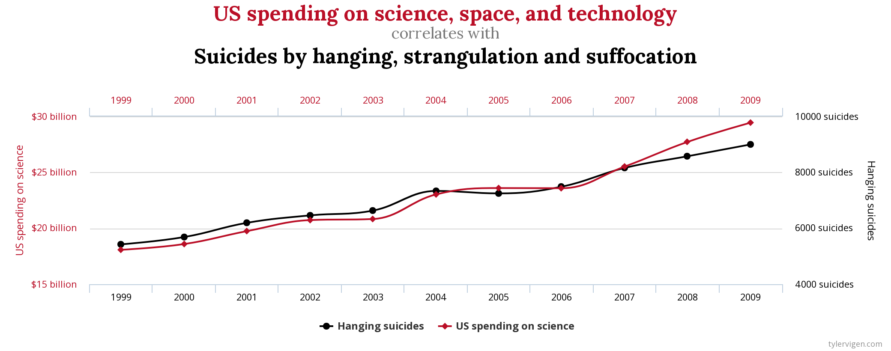
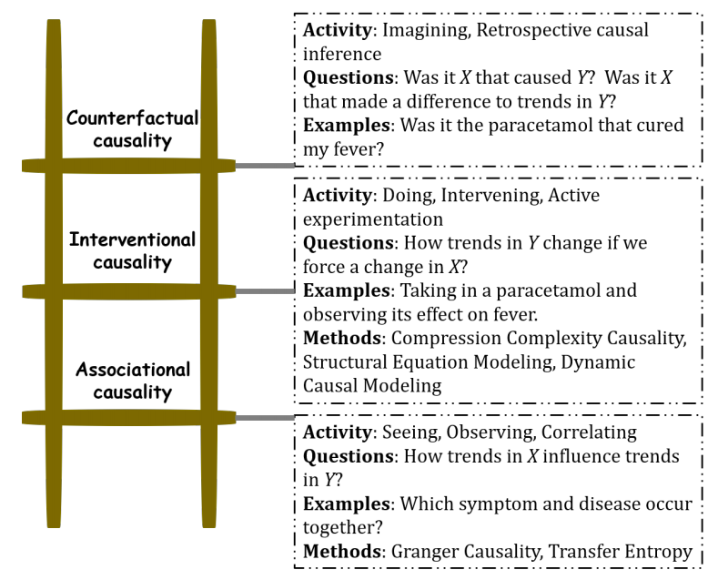

### Spurious Correlation

Some __Causally Unrelated__ variables, which we are very sure have no relation whatsoever, may be highly correlated over a period of time. For example, __US spending on science, space and technology__ is highly correlated with __Suicides by hanging, strangulation and suffocation__.

Visit [Spurious Correlations by Tyler Vigen](http://tylervigen.com/spurious-correlations) for more such examples.

If not properly used, this can be abused by the scientific community and can cause catastrophic consequences in peoples lives.

For example, [this __Science Daily__ article](https://www.sciencedaily.com/releases/2020/04/200422091205.htm) suggests that obesity can lead to sleep loss based on the behaviour of worms.

Most such studies are interpreted causally. But we do not know if these correlations are worthy  of focus.
Sometimes, controlled experiments are performed for causal studies. For example, in [this __Science Daily__ article](https://www.sciencedaily.com/releases/2020/02/200214134655.htm), a group of mice were given Green Tea Extract and were subjected to exercise, and another group wasn't.

There are examples of published studies, which can be misleading. For example, [a 2012 paper published in _New England Journal of Medicine_](https://www.nejm.org/doi/full/10.1056/NEJMon1211064) claimed that chocolate could enhance cognitive function. Authors couldn't find any data on national intelligence, so instead they used the total number of Nobel prize winners per capita.  The correlation between chocolate consumption and Nobels is remarkably strong, with a p-value less than 0.0001, meaning that the odds that this is due to chance are less than 1 in 10,000. Of course, the focus should have been the amount of chocolates the Nobel Prize winner were having to properly quantify the effects of chocolate on cognitive function. As a result, a person from a non-scientific background may feed their kids a lot of chocolate, thereby risking tooth cavities in them.

### Mathematics of Causal Inference - Requirement

If we really want to correlate two variables, their causal effects should have a formal mathematical definition. Also, assumptions that are required to identify cause-effect from data should be chosen carefully. Also, the impact of violation of these assumptions on the conclusions made needs to be evaluated.

### Correlation

__Correlation__ is a statistical technique which tells how strongly a pair of variables are linearly related and change together, but does not give any information about the "why" and the "how" of the relationship.

$$ \rho_{X, Y} = \frac{\mathbb E[(X - \mu_X)(Y - \mu_Y)]}{\sigma_X\sigma_Y} $$

where $\mu_X = \mathbb E[X]$ is the expectation of $X$ and $\sigma_X$ is the standard deviation of $X$.

### Causation

__Causation__ indicates if one even is a result of occurrence of another event. It is asymmetric in nature.

>-  A variable $X$ can be said to be a cause of another variable $Y$ if it makes a difference to $Y$ and the difference $X$ makes must be a difference from what would have happened without it.
>- Chronologically, the cause should happen before the effect.    

Quote by David Hume.

For example, in summers, we can expect an increase in sale of fans and the sale of ice-creams. Hence, these two variables are correlated. But even if ice-creams did not exist, hot weather would still increase the sale of fans. Hence, the increase in sale of fans is not a cause of increase in sale of ice creams.

### Correlation vs Causation

Until the twentieth century, causation was a 'non-scientific' concept. That was primarily because the field of statistics was dominated by the people who discovered correlation. One of the pioneers of statistics, Galton, discovered correlation first; causation seemed to him to be only a limited category of correlation. Pearson, another pioneer of statistics as well as Galton's student, felt that
> causation is only a matter of re-occurrence of certain sequences and science can in no way demonstrate any inherent necessity in a sequence of events nor prove with certainty that the sequence must be repeated.

Causation for them was probably deterministic. Hence, the sequence should be repeated.

### Types of Causality

Causal inferences are based on both observational and experimental studies.

- **Zero-Level:** Statistical association of a past event (cause) with a present event(effect).   
e.g. Wiener-Granger Causality

- **First-Level:** Compares the outcomes arising under different interventions, given two or more (possible) interventions in a system.   
e.g. Randomised Control Experiments.   

- __Second Level:__ What underlying processes were involved for the causal relations observed.
e.g. Causal path diagrams, Structural equation models.

### Ladder of causation

[Judea Pearl](https://en.wikipedia.org/wiki/Judea_Pearl)'s work on machine learning convinced him that for machines to learn to make decisions like humans, they cannot continue to make associations based on data alone but needed to have causal reasoning analogous to the human mind. He proposed the following 'Ladder of Causation':

- **Association** involves observing regularities in the data to associate past events to future ones. Correlation under Zero-Level view of causality work based on association.

- __Intervention__ involves actively changing what is there and then observing its effect. Randomised Control Experiments as well as model based causality measures(which aim to find the underlying generating mechanism) fall under this category. Correlation under First and Second Level views of causality work based in Intervention. When model based measures do not directly intervene, they invert the assumed model to obtain its various parameters based on available data. The complete model can be helpful to intervene, such as to make predictions about situations for which data is unavailable.

- __Counterfactuals__ involves imagination. The power of imagination is exercised to infer the cause. To date, no computational method to establish causality by counterfactual reasoning has been devised. For example, imagination of reality that is not present like when Einstein asked "what if we travel at a speed of light". A situation like this cannot be simulated or emulated, but by imagining the consequences, Einstein could formulate special relativity.

### Causality for Time Series

According to Wiener,
> if a time series $X$ _causes_ a time series $Y$, then past values of $X$ should contain information tat help predict $Y$ above and beyond the information contained in the past values of $Y$ alone.

Several methods are based on this approach of Causality.

If with the inclusion of past $X$,
- prediction power of $Y$ increases, then there us a non-zero **Granger Causality** from $X$ to $Y$.
- uncertainty of $Y$ decreases, then there is a non-zero **Transfer Entropy** from $X$ to $Y$
- dynamical complexity of $Y$ increases or decreases, there there is a non-zero **Compression-Complexity Causality** from $X$ to $Y$.

For a more holistic picture, refer [this article](https://arxiv.org/abs/1910.08750)

## Random Experiments

**Random Experiments**  are experiments whose outcomes cannot be surely predicted in advance. If the experiment is repeated a large number of times, one can observe some 'regularity' in the average output, but for a single experiment, outcome is unpredictable.    
e.g. tossing a coin, rolling a die etc.

**Probability Theory**(also described in [Lecture 3](2020-01-29-lecture3.md)): A mathematical theory to describe Random Experiments.

#### Main ingredients:

__The State Space($\Omega$):__ The set of all possible outcomes of an experiment.     
e.g., for a coin toss,
$$\Omega = \{h, t\}$$   
And for two successive tosses,    
$$\Omega = \{hh, ht, th, tt\} $$  

__Events:__ A property that can be observed either to hold or not to hold after the experiment is done. It is a subset of $\Omega$.   
_Sure Event:_ $\Omega$   
_Impossible Event:_ $\phi$    
_Elementary Event:_ singleton set $\\{w\\}$ containing a single outcome $w \in \Omega$.  

For a countable set $\Omega$, the cardinality of the family of all the events is $2^{\|\Omega\|}$, which means, the family of all the events is the set of all subsets of $\Omega$.    

__Probability:__ Measures the likelihood for an event $A$ to be realised before performing the experiment. It is a number associated with each event.     

Properties of probability:   
- for any event $A$, $0 \leq P(A) \leq 1$  
- $P(\Omega) = 1$
- for any events $A$ and $B$, $P(A \cup B) = P(A)+P(B)$ if $A\cap B =  \phi$

## The $\sigma$-Algebra

Let $\Omega$ is an abstract space, $2^\Omega$ be the family of all subsets of $\Omega$, including $\phi$.   

Let $\mathcal{A} \subset 2^\Omega$ with the following properties:  
1. $\phi \in \mathcal A$, $\Omega \in \mathcal{A}$  
1. if $A \in \mathcal{A}$, then $A^c \in \mathcal A$  
1. $\mathcal A$ is closed under finite unions and finite intersections. If $A_1, A_2, \dots, A_n \in \mathcal A$, then, $\bigcup_{i=1}^n A_i \in \mathcal A$ and $\bigcap_{i=1}^n A_i \in \mathcal A$   
1. $\mathcal A$ is closed under countably infinite unions and intersections. If $A_1, A_2, \dots \in \mathcal A$, then, $\bigcup_{i=1}^\infty A_i \in \mathcal A$ and $\bigcap_{i=1}^\infty A_i \in \mathcal A$  

If properties 1, 2 and 3  are satisfied, then $\mathcal A$ is an algebra. If properties 1, 2, 4 are satisfied, then $\mathcal A$ is **$\sigma$-Algebra**.    

If $\mathcal A$ is a $\sigma$-algebra, then the pair $(\Omega, \mathcal A)$ is called a **measurable space** or **Borel Space**.

#### Axioms of probability

A **Probability Measure** defined on a $\sigma$-Algebra $\mathcal A$ of $\Omega$ is a function $P:\mathcal A \rightarrow [0, 1]$ that satisfies:  

1. $P(\Omega) = 1$
1. for any $A \in \mathcal A$, $P(A) \geq 0$
1. For every pairwise disjoint countable sequence, $(A_n)$, for $n \geq 1$ of elements of $\mathcal A$(i.e., $A_n \cap A_m = \phi$, $n \neq m$), one has:
$$\begin{equation}
\tag{Countable Additivity}
P(\bigcup_{n=1}^\infty A_n) = \sum_{n=1}^\infty P(A_n)
\end{equation}$$

If the above conditions are satisfied, then $(\Omega, \mathcal A, P)$ is called a **Probability Space**.

Examples of $\sigma$-algebra:   
1. $\mathcal A = \\{\phi, \Omega\\}$ (trivial $\sigma$-algebra)
1. $\mathcal A = \\{\phi, \\{A\\}, \\{A^c\\}, \Omega \\}$

### Class $\mathcal A$ of Events

We do not consider as events all subsets of $2^\Omega$ but only a  class $\mathcal A$ of events.

Reasons:  
1. **Nature of Application:** e.g. In a dice experiment, if we wish to bet only even or odd, then we can consider only four events: $\\{\phi\\}, \\{even\\}, \\{odd\\}, \Omega$.   
1. **Major Reason:** for uncountably infinite $2^\Omega$, it is impossible to assign probabilities to all the subsets, satisfying the axioms of probability.

### Examples of Probability Spaces

1. $\Omega = \\{h, t\\}$   
$\mathcal A = \\{\phi, \\{h\\}, \\{t\\}, \Omega\\}$   
Let $P(h) = p$ and $P(t) = q$. Then, $p+q=1$.
1. If $\Omega$ consists of an uncountable infinity of elements, then its probabilities cannot be determined in terms of the probabilities of elementary events.      
>e.g. $\Omega = \mathbb R$    
Its subsets are sets of points on the real line. It is impossible to assign probabilities to all subsets of $\Omega$ so as to satisfy the axioms.  

To construct a probability space, we consider as events all intervals $x_1 \leq x \leq x_2$, and their countable unions and intersections. This forms a **$\sigma$-field** or **Borel field**, $\mathcal A$.  

Smallest Borel field includes all __half-lines__ $x\leq x_i$, where $x_i$ is any number.  

Suppose, $\alpha(x)$ is a function, such that   

$$ \int_{-\infty}^{\infty} \alpha(x) dx = 1 \quad\quad \alpha(x) \geq 0 $$  

Then, $P\\{x \leq x_i\\} := \int_{-\infty}^{x_i}\alpha(x)dx$. This specifies probabilities of all events of $\Omega$.  

$$P\{x_1 < x \leq x_2\} = \int_{x_1}^{x_2} \alpha(x)dx$$  

Events $\\{x\leq x_1\\}$ and $\\{x_1<x\leq x_2\\}$ are _mutually exclusive_. Hence,   

$$ P\{x \leq x_1\} + P\{x_1 < x \leq x_2\} = P\{x \leq x_2\}$$   

If the function $\alpha(x)$ is bounded, $P\\{x_1 < x \leq x_2\\} \to 0$ as $x_1 \to x_2$.

__$P\\{x_2\\} = 0 \quad\forall$ elementary events $x_2 \in \Omega$. However, probability of their unions sums up to 1.__

This is not a problem as elementary events are uncountably infinite.
