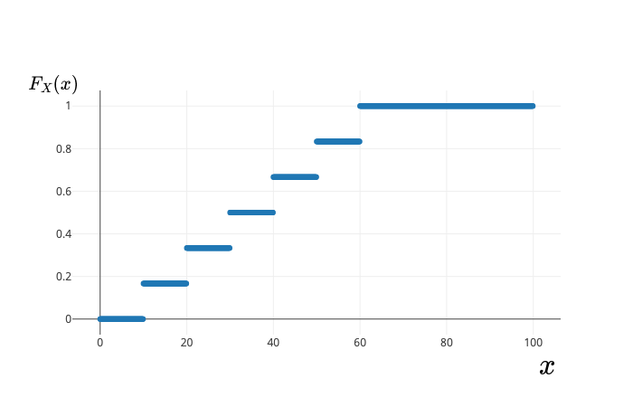
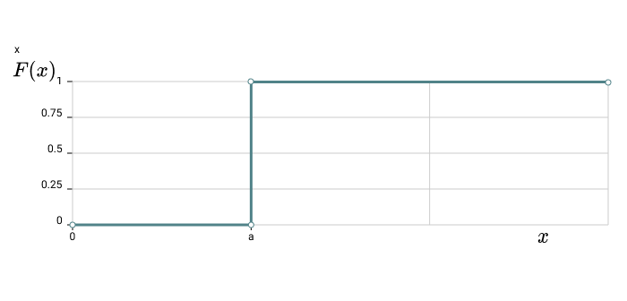
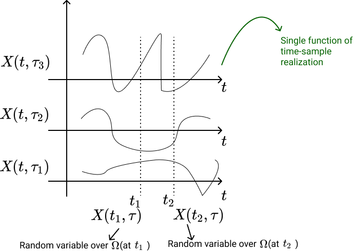
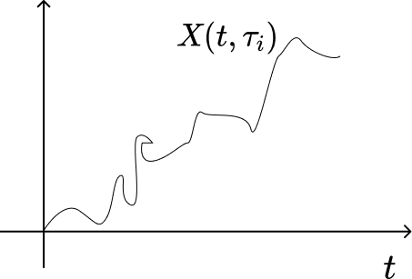
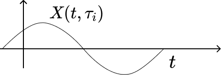

## Random Variables

A mapping from $\Omega$ to a space $E$, where often $E=\mathbb R$ or $E=\mathbb R^d$.    
e.g. In the dice experiment, we assign each outcome $f_i$ with the number $X(f_i)=10i$    
$X(f_1) = 10$, $X(f_2) = 20$, $\dots$, $X(f_6)=60$   

In general, we can talk about events generated by $X:\Omega \rightarrow E$ and be able to assign probabilities to them. This is to 'transport' the probabilistic structure to $E$.

$$ P^X(B) = P(X^{-1}(B)) \quad \forall B \subset E$$

where, $X^{-1}(B)$ is the pre-image of $B$  by $X$, i.e., the set of all $w \in \Omega$ such that $X(w) \in B$.

For the probabilities to be assigned, we need $X$ to be a **measureable function**, $X:\Omega \rightarrow E$. Here, $\Omega$ should be the sample space of $(\Omega, \mathcal A, P)$. $X$ should satisfy some mild conditions:

Let a $\tau \in \Omega$ be mapped to $X(\tau)$ by $X$, and let $\\{X\leq x\\}$ represent a subset of $\Omega$ containing all $\tau$ such that $X(\tau) \leq x$
>- **Condition 1:** The set $\\{X\leq x\\}$ is an event for every $x$.
>- __Condition 2:__ The probabilities of the events $\\{X=\infty\\}$ and $\\{X = -\infty\\}$ are **zero**.

These conditions ensure that $X$ is over some space $\Omega$.   

If $X:\Omega \rightarrow \mathbb R$ is defined on $(\Omega,  \mathcal A, P)$, we can ask questions like:    
_"How likely is it that the value of $X$ is equal to 2?"_    
This is the same as $P\\{\tau: X(\tau) = 2\\} = P(X=2) = P_X(2)$. Using these  probabilities, we can get a _probability distribution of $X$._  

**Probability Distribution** forgets about $\Omega$ and records probabilities at different values of $X$.    

**Cumulative Distribution Function (cdf)** of X:     
$$ F_X = P(X\leq x)$$      

The underlying $\Omega$ is a technical device to:
1. Guarantee the existence of random variables
1. To construct random variables
1. Define notions - __correlation, dependence, independence__ based on __joint distribution__ of two or more random variables defined on the same $\Omega$.  

In practice, $\Omega$ is disposed and we work with probability distributions.    

e.g. In the dice experiment, $X(f_i) = 10i$. If the dice is fair, then $F_X$ is given as:

e.g. Suppose r.v. $X$ is such that $X(\tau)=a$ $\forall \tau\in\Omega$.  
For $x\geq a$, all $\tau$ have been mapped to $a$ as $X(\tau)=a$ $\forall \tau$        

$$\implies F(x) = P\{X\leq x\} = P(\Omega) = 1 \quad \quad \forall x\geq a$$

For $x<a$, $\\{X\leq x\\}$ is an impossible event because $X(\tau) = a$  
$$ F(x) = P\{X\leq x\} = P(\phi) = 0 \quad\quad \forall x<a$$  

## Stochastic/Random Processes

A random variable $X$ is a rule for assigning to every outcome $\tau$ of an experiment $S$ a number $X(\tau)$. A __Stochastic Process__ $X(t)$ is a rule for assigning to  every $\tau$ a function $X(t, \tau)$.

Here,  
- __Domain of $\tau$:__ The set of all experimental outcomes
- __Domain of $t$:__ If the domain of $t$ is $\mathbb Z$, $X(t, \tau)$ is known as a _discrete-time process_. If the domain is $\mathbb R$, it is known as a _continuous-time process_.      

Hence, a __stochastic process__ is defined as a _collection/family_ of random variables that is indexed by some mathematical set. Each random variable is __uniquely__ associated with a particular element in the index set.

Index set $\subseteq \mathbb R$, giving a notion of time.  

All these random variables are over a common probability space $\Omega(\mathcal A)$, in order to define a joint distribution, correlation etc.  

#### Examples:

1. __Brownian Motion:__ Motion of microscopic particles in collision with other particles.     
$X(t, \tau)$ or $X(t)$ $\rightarrow$ motion of all particles (_ensemble_)  
$X(t, \tau_i)$ $\rightarrow$ motion of a specifice particle (_sample_)  
  

1. Voltage of an ac generator with random amplitude $r$ and phase $\phi$.  

Ensemble $\rightarrow$ family of pure sine waves  

$$X(t) = r\cos(\omega t+\phi) \\ X(t, \tau_i) = r(\tau_i)\cos(\omega t+\phi(\tau_i))$$
  

The above processes are stochastic because  

##### Example 1

- Cannot be described in terms of finite number of parameters
- Future of a sample $X(t, \tau_1)$ cannot be determined based on its past
- Statistics of $X(t, \tau)$ can be determined based on a single sample $X(t, \tau_1)$  

##### Example 2

- Completely specified in terms of r.v.'s $r$ and $\phi$.
- If $X(t, \tau_1)$ is known for $t \leq t_0$, then it is determined for $t>t_0$.
- Single sample $X(t, \tau_1)$ does not specify properties of the entire process because it depends only on particular values $r(\tau_1)$ and $\phi(\tau_1)$

**Another Example:** Construct a random process as follows:
  : For a coin toss experiment, define random variables at each time point as follows
       
  : **Points to Note:**  
    - $X(t_1)$, $X(t_2), \dots$ map events differently. But at each time point, mapping remains the same. As a result, _we can define probability distributions for these random variables._
    - Sample space of entire sequences/signals is different from the sample space from which each random variable $X(t_1), X(t_2), \dots$ etc. arise.
    - Each of the coin toss may not be independent; say, outcome of a toss at $t_3$ may dependent on a toss at $t_1$. This affects their **PDF's, joint PDF's.**
    - Maybe, we started with a fair coin, but gradually, with time, the coin became biased(weared out etc.). Maybe with passing time, wind, temperature and other environmental factors changed, affecting the occurrences of the outcomes. So, considering the r.v.  (or mapping) and its PDF to be different at each $t$.

    > **Remark:** We don't know if the stochastic processes occur in nature, but we use them to model phenomena.   

#### Equality

$X(t)$ and $Y(t)$ are equal if their respective samples $X(t, \tau)$ and $Y(t, \tau)$ are identical $\forall ~ \tau$

### Applications of Random Processes

Random processes are used to model:

1. Received Sequence at the output of a communication channel.
1. Thermal Noise in resistors
1. Daily stock prices
1. Winnings or losses of a gambler

### Statistics of Stochastic Processes

Stochastic process is an uncountable infinity of r.v.'s, one for each $t$ (if $t \in \mathbb R$). For a specific $t$, $X(t)$ is a random variable with distribution  

$$ F_X(x, t) := P\{X(t) \leq x\} $$  

where,

- $F_X(x, t)$ is a **first order distribution**.
- $P\\{X(t) \leq x\\}$ consists of all outcomes $\tau$ such that at a specific $t$, $X(t, \tau) \leq x$

**First order density**  
$$f_X(x, t):= \frac{\partial F_X(x, t)}{\partial x} $$

**Second order distribution**
  $$ F(x_1, x_2; t_1, t_2) := P\{X(t_1) \leq x_1, X(t_2) \leq x_2\} $$  

= *Joint distribution of $X(t_1)$ and $X(t_2)$*

**Second order density**
  $$ f(x_1, x_2; t_1, t_2) := \frac{\partial^2 F(x_1, x_2; t_1, t_2)}{\partial x_1 \partial x_2} $$  

Hence, **$n^{th}$ order distribution of $X(t):$** **Joint distribution** $F(x_1, \dots, x_n; t_1, \dots, t_n)$ of the r.v.s $X(t_1), X(t_2), \dots, X(t_n)$

#### Second Order Properties

**Mean $\mu(t)$:**
  $$ \mu(t) := \mathbb E\{X(t)\} = \int_{-\infty}^{\infty} xf(x, t)dx $$

**Autocorrelation:**
  $$ R(t_1, t_2) := \mathbb E\{X(t_1)X(t_2)\} = \int_{-\infty}^\infty \int_{-\infty}^\infty x_1x_2 f(x_1,x_2; t_1, t_2)dx_1dx_2$$      

  *If $t_1 = t_2 = t$, average power of $X(t)$:*

$$E\{X^2(t)\} = R(t, t)$$

**Autocovariance:**
  $$ c(t_1, t_2) := R(t_1, t_2) - \mu(t_1)\mu(t_2) $$    

  $$ c(t, t)= \sigma^2(t)$$      
  where $\sigma^2(t)$ is the variance of $X(t)$

## Stationary Processes  

### Strict and Wide/Weak Sense Stationary

**Strict Sense Stationary (SSS)** processes are processes whose statistical properties are invariant to arbitrary time shifts. i. e. $X(t)$ and $X(t+c)$ have the same statistics for any $c$.

**$n^{th}$ order density of an SSS**      

$$ f(x_1, x_2, \dots, x_n;~t_1, t_2, \dots, t_n) = f(x_1, \dots, x_n;~t_1+c, \dots, t_n+c)$$  

for any $c$.

Hence, the **first order density** $f(x;~t) = f(x;~t+c) \implies f(x;~t)$ is ***independent*** of $t \implies f(x;~t)=f(x)$.  

Or, if we look at the cumulative distribution:  

$$ F(X_{t_1}\leq x_1, X_{t_2} \leq x_2 \dots X_{t_n} \leq x_n)= F(X_{t_1+c} \leq x_1, X_{t_2+c} \leq x_2, \dots, X_{t_n+c} \leq x_n ) $$  
(Using a different notation, as at each $t$, we have a different random variable.)

**Definition:** $X(t)$ is SSS if all $n$-point joint CDF's are invariant to arbitrary time shifts. i.e. the above equation holds for arbitrary $n$.  

*SSS is hard to show as it requires access to full characterisation ($n$-point CDF's)*

**Example: IID process in SSS**
  : For $X_t \sim^{i.i.d} F_X~$:  
  $$ \begin{align*}
  F(X_{t_1} \leq x_1, \dots, X_{t_n} \leq x_n ) &= \prod_{i=1}^n F(X_{t_i} \leq x_i) \\
    &= \prod_{i=1}^n F(X_{t_i+c} \leq x_i)\\
    &= F(X_{t_1+c} \leq x_1, \dots, X_{t_n+c} \leq x_n )
   \end{align*} $$  
  : for any arbitrary $c \in \mathbb Z$. Hence, $X_t$ is SSS.

#### Mean, Variance and Covariance

$\\{ X(t) \\}$ is SSS. $\implies F_{X(t)} = F_{X(t+c)} = F_{X(0)}$  

$$
\begin{equation*}
\tag{M&V}
\implies
\begin{cases}
\mu_X(t) = \mu_X(0) =: \mu_X \\
\sigma^2_X(t) = \sigma^2_X(0) =: \sigma^2_X
\end{cases}
\label{eq1}
\end{equation*}
$$  

Also, joint CDF  
$$ F_{X(t_1)X(t_2)} = F_{X(t_1+c)X(t_2+c)}$$  
Let $c = -t_2$  
$$
\implies F_{X(t_1)X(t_2)} = F_{X(t_1 - t_2)X(0)}
$$  
$$
\begin{equation*}
\tag{Cov}
\implies C_X(t_1, t_2) = C_X(t_1 - t_2, 0) =: C_X(t_1-t_2)
\label{eqMVC2}
\end{equation*}
$$  

*Covariance depends only on the time-shift.*  

If $\eqref{eq1}$ and $\eqref{eqMVC2}$ hold, it does **not** imply that the process is SSS. However, it implies that the process is **Wide/Weak Sense Stationary**.  

**Example - WSS process**  

$$ X_t \sim^{independent} \begin{cases} \mathcal U (-\sqrt{3}, \sqrt{3}), \quad t \text{ odd} \\
\mathcal N(0, 1), \quad t \text{ even} \end{cases}$$  

Then  
$$ \mu_X(t) = 0 $$  

And  
$$
\begin{align*}
C_X(t_1, t_2) &= \begin{cases} 1, \quad t_1=t_2 \quad \text{"variance"} \\
0, \quad t_1 \neq t_2 \quad \text{"covariance"} \end{cases} \\
&= \delta(t_1 - t_2)
\end{align*}
$$  

But $X_t$ is not SSS since $F_{X_{t_1}} \neq F_{X_{t_2}}$  

## Ergodic Processes

$X(t, \tau)$ or $X(t) \rightarrow$ random process  
$g(X) \rightarrow$ function on a  random process  

1. **Ensemble Averaging:**

$$ E\{ g(X(t=t_0)) \} = \int_{-\infty}^{\infty}g(x)f_X(x;~t_0)dx$$  For **stationary** processes:  
$$ E\{g(X)\} = \int_{-\infty}^{\infty} g(x)f_X(x) dx $$  

1. **Time-Domain Averaging:**  
Using a sample realization -  
$$ \langle g(X) \rangle = \lim_{T \to \infty} \frac{1}{T} \int_T g(X(t, \tau_1))dt $$  

A process is known as an **Ergodic** process if  
$$ E\{g(X)\}  = \langle g(X)\rangle$$

Multiple realisations of a process are not required.A single realisation can help get all possible averages. (As, $g(X)$ could be $X$ or $X^2$ or $X^3$ )  

