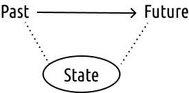
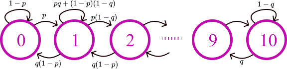
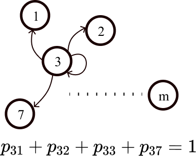

## Markov Chains/Processes:

**Markov Processes** are a kind of stochastic processes which assume that the random variable $X_t$ captures all the information relevant for predicting the future. Hence, future depends upon the past and to some extent, can be predicted from the past.  

Consider models in which past $\rightarrow$ future influence is summarised using states (which evolve based on PDF's).
  

**Discrete time $\implies$ Chains**     
**Continuous time $\implies$ Processes**      

### Checkout Counter Example:

Lets model a queue with certain assumptions:   

- Probability of arrival of a random person at any time - $p$  
- Probability of the departure of a person already in the queue - $q$   
- Arrival and departure of people is mutually independent  
- The maximum capacity of the queue is 10, and at each time instance, only one arrival and one departure are allowed.   

#### Observations

- Transition probabilities are defined similarly for states $s \in [1:9]$, but differently for $s\in \\{0, 10\\}$   
- 'State' $X_n/X_{t_n}$: number of customers at time $n$.  
- From one time step to next, if we sum up all possible transition probabilities, they should sum up to 1.   

### Discrete Time Finite State Markov Chains    

- $X_{t_n}$: state after $n$ transitions  
- Initial state $X_{t_0}$ could be given at random    
- States belong to a finite set    
- Transition probabilities:       

$$
p_{ij} = P(X_{t_1}=j~\big|X_{t_0}=i) = P(X_{t_{n+1}}=j~\big|X_{t_n}=i)~~\forall n    
$$    

which implies, the transition probabilities are **time homogenous/time invariant**.   

### Markov (defining) property/assumption:  

> Given the current states, the past doesn't matter.    

**Markov Chain of order:**      

$$\begin{aligned} P(X_{t_{n+1}} = x_{n+1}~\big| X_{t_{n}} = x_{n}, X_{t_{n-1}} = x_{n-1}, \dots, X_{t_{1}} = x_{1} )\\ = P(X_{t_{n+1}} = x_{n+1}~\big|X_{t_{n}} = x_{n})\end{aligned}$$    

where, $x_{n+1}, x_{n}, \dots, x_{1}$ are the states of the process.   

**Markov Chain of Order $k$**

$$\begin{aligned} P(&X_{t_{n+1}} = x_{n+1}~\big| X_{t_{n}} = x_{n}, X_{t_{n-1}} = x_{n-1}, \dots, X_{t_{1}} = x_{1} )\\ &= P(X_{t_{n+1}} = x_{n+1}~\big|X_{t_{n}} = x_{n}, X_{t_{n-1}} = x_{n-1}, \dots,X_{t_{(n+1)-k}} = x_{(n+1)-k})\end{aligned}$$    
