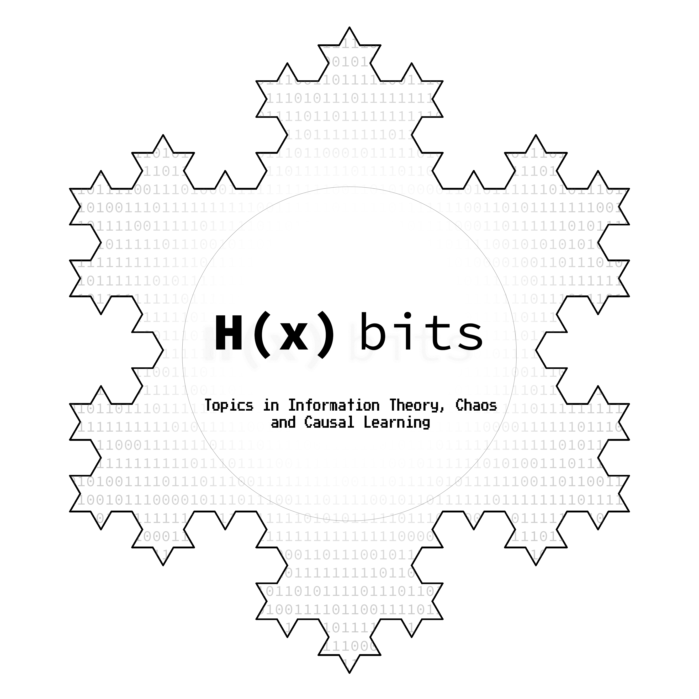

# About Us

This website contains lecture notes of the course __"Topics in Information Theory, Chaos and Causal Learning"__(2 credits) offered at __National Institute of Advanced Studies(NIAS)__ during Jan-May 2020.

## Instructor
[**Dr. Nithin Nagaraj**](https://sites.google.com/site/nithinnagaraj2/).  A few lectures were given by Ms. Aditi Kathpalia (on Causality).

## Students

1. Abhishek Nandekar (NIAS)
2. Harikrishnan N. B.(NIAS)
3. Dr. Pranay Yadav (NIAS)
4. Aditi Kathpalia (NIAS)
5. Rahul Venugopal (NIMHANS)

## Scribe

Each lecture note has been scribed by one or more of the students. The name of the scribe appears at the top of each lecture note.

## Logo

Designed by Abhishek Nandekar. The shape represents an iteration of the __Koch Island__, which
is a fractal (when iterated to eternity). Each side of the Island is the Koch Curve which has a fractal
dimension (box-counting dimension) of 1.28. The interior contains **binary digits** (“bits”) and the title
of the course is in vintage computer font types (a tribute to the yesteryears of computing). **H(X) bits**
is the representation of Claude Shannon’s most famous Entropy term for random variable X. The
fundamental unit of information is ‘bit’ or ‘shannon’.
