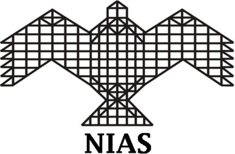

# Welcome
This is the homepage of H(x) bits which contains lecture notes on the course "Topics in Information Theory, Chaos and Causal Learning" offered by [Dr. Nithin Nagaraj](https://sites.google.com/site/nithinnagaraj2/) (Email: nithin@nias.res.in) at the [Consciousness Studies Programme](http://niasconsciousnesscentre.org/index.html), [National Institute of Advanced Studies](http://www.nias.res.in/), Bengaluru.

